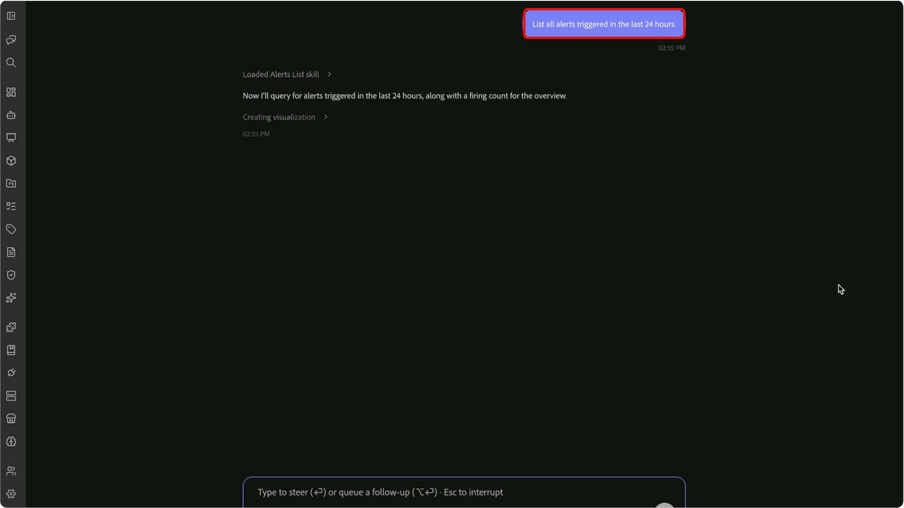

# Customer Alert Skills

>[!AVAILABILITY]
>
> Customer Alert Skills stehen allen Kunden zur Verfügung, die Zugriff auf Adobe CX Enterprise Coworker haben.
>
> Um Warnhinweise für Kunden verwenden zu können, müssen Sie Zugriff auf Warnhinweise für Adobe Experience Platform und die mit diesen Warnhinweisen verknüpften Ressourcen haben.

Verwenden Sie die Warnhinweis-Fähigkeiten von Kunden in CX Coworker, um eine Warnhinweisaktivität in ein personalisiertes operatives Briefing zu verwandeln. Überprüfen Sie aktuelle Warnhinweise, identifizieren Sie Probleme von hoher Priorität, verstehen Sie, welche Ressourcen betroffen sind, und konzentrieren Sie Ihre Ermittlungsbemühungen über Gespräche in natürlicher Sprache.

Die Fähigkeiten zu Warnhinweisen für Kunden helfen Ihnen, von Warnhinweisen zu umsetzbaren Einblicken zu wechseln, ohne die Warnhinweisansichten manuell zu überprüfen oder Informationen über mehrere Schnittstellen hinweg zu korrelieren. Beginnen Sie mit einer allgemeinen Frage zur letzten Aktivität von Warnhinweisen und verwenden Sie Folgefragen, um Muster von wiederkehrenden Warnhinweisen zu identifizieren, betroffene Objekte zu analysieren und sich auf die Warnhinweise zu konzentrieren, deren Inhaber Sie sind.

Weitere Informationen zu Kundenwarnhinweisen finden Sie in der [Übersicht über Kundenwarnhinweise](https://experienceleague.adobe.com/de/docs/experience-platform/observability/alerts/overview).

## Voraussetzungen {#prerequisites}

Bevor Sie beginnen, stellen Sie Folgendes sicher:

- Zugriff auf Adobe Experience Platform.
- Berechtigung zum Anzeigen von Warnhinweisen, die für Ihre Organisation relevant sind.
- Das in CX Coworker installierte Adobe CXO-Plug-in.

Anleitungen für die Installation von Plug-ins finden Sie unter https://experienceleague.adobe.com/en/docs/cx-enterprise-coworker/content/chat/ui-guide.

## Verwendung von Warnhinweisen für Kunden {#use-customer-alert-skills}

Interagieren Sie über CX Coworker mit Warnhinweisen für Kunden und verwenden Sie Anforderungen in natürlicher Sprache. Stellen Sie Fragen zu Warnhinweisaktivitäten, Abonnements, Warnhinweistrends oder betroffenen Objekten. Setzen Sie das Gespräch mit Folgefragen fort, um die Ergebnisse zu verfeinern und Ihre Analyse zu fokussieren.

So verwenden Sie Warnhinweise für Kunden:

1. Navigieren Sie zu **[!UICONTROL CX Coworker]**.

1. Geben Sie eine Frage oder Anfrage zu Ihren Warnhinweisen ein. Beispiel:

   *„Auflisten aller in den letzten 24 Stunden ausgelösten Warnhinweise?“*

   

1. Überprüfen Sie die von Customer Alert Skills zurückgegebenen Ergebnisse.

   

1. Verfeinern Sie die Ergebnisse mit Folgefragen. Beispiel:

   *„Zeigen Sie mir die drei wichtigsten Warnhinweistypen, die in den letzten 24 Stunden ausgelöst wurden.“*

   

1. Fahren Sie mit der Eingrenzung des Umfangs fort, bis Sie die Warnhinweise, Muster oder betroffenen Objekte identifizieren, die Aufmerksamkeit erfordern. Beispiel:

   *„Listen Sie die fünf Objekte auf, die von Warnhinweisen mit hohem Schweregrad betroffen sind“*

   

Warnhinweis-Fähigkeiten sorgen für einen Gesprächskontext, sodass Sie von der Warnhinweisaktivität zur zielgerichteten Untersuchung fortfahren können, ohne frühere Anfragen zu wiederholen.

## Unterstützte Anwendungsfälle {#supported-use-cases}

Verwenden Sie Warnhinweise von Kunden, um operative Aktivitäten zu überwachen, Probleme zu untersuchen und sich auf die Warnhinweise zu konzentrieren, die für Ihre Rolle am relevantesten sind.

### Warnungsaktivität überprüfen

Überprüfen Sie den aktuellen Warnhinweisstatus oder untersuchen Sie historische Warnhinweisaktivitäten innerhalb eines bestimmten Zeitraums.

Beispiel:

- „Welche Warnhinweise wurden in den letzten 24 Stunden ausgelöst?“
- „Aktive Warnhinweise der letzten sieben Tage anzeigen.“

### Identifizieren von Mustern wiederkehrender Warnhinweise

Überprüfen Sie den Warnhinweisverlauf, um die Warnhinweistypen zu identifizieren, die in Ihrer Organisation am häufigsten vorkommen. Anstatt eine große Anzahl einzelner Warnhinweisereignisse zu überprüfen, sollten Sie die Fähigkeiten von Kundenwarnhinweisen verwenden, um wiederkehrende Muster zusammenzufassen und Bereiche hervorzuheben, die möglicherweise Aufmerksamkeit erfordern.

Beispiel:

- „Zeigen Sie mir die drei wichtigsten Arten von ausgelösten Warnhinweisen.“
- „Welche Warnhinweistypen traten in diesem Monat am häufigsten auf?“

### Konzentration auf Themen mit hoher Priorität

Ergebnisse auf einen bestimmten Schweregrad beschränken, um Ermittlungsbemühungen zu priorisieren.

Beispiel:

- „Nur Warnhinweise mit hohem Schweregrad anzeigen.“
- „Welche kritischen Warnhinweise wurden diese Woche ausgelöst?“

### Verstehen des Auswirkungsradius von Warnhinweisen

Identifizieren Sie, welche Objekte am häufigsten betroffen sind, und verstehen Sie, wo mit der Untersuchung begonnen werden sollte.

Customer Alert Skills analysieren die Aktivität von Warnhinweisen und zeigen die Objekte auf, die mit wiederkehrenden oder schwerwiegenden Warnhinweisen verbunden sind, sodass Sie sich auf die Bereiche mit den größten betrieblichen Auswirkungen konzentrieren können.

Beispiel:

- „Was sind die fünf am stärksten betroffenen Objekte?“
- „Welche Objekte sind den Warnhinweisen mit dem höchsten Schweregrad zugeordnet?“

### Verbinden von Warnhinweistypen mit betroffenen Objekten

Verstehen, wie sich Warnhinweisaktivität auf bestimmte Ressourcen auswirkt.

Customer Alert Skills verbinden betroffene Objekte mit den Warnungstypen, die sie ausgelöst haben, sodass Sie Muster identifizieren und die wahrscheinliche Quelle für betriebliche Probleme ermitteln können.

Beispiel:

- „Welche Warnhinweistypen haben sich am häufigsten auf diesen Datensatz ausgewirkt?“
- „Zeigt die Beziehung zwischen Warnhinweistypen und betroffenen Objekten.“
- „Welcher Warnungstyp hat das am häufigsten betroffene Objekt am häufigsten beeinflusst?“

### Fokus auf meine Warnhinweise

Analysieren Sie die Warnhinweise, die Sie abonniert haben und die für die Überwachung verantwortlich sind.

Nutzen Sie das [!DNL My Alerts] Erlebnis, um die letzten Aktivitäten zu überprüfen, schwerwiegende Probleme zu priorisieren und die operative Analyse auf die Warnhinweise zu konzentrieren, die für Ihre Rolle am relevantesten sind.

Beispiel:

- „Zeigen Sie mir die Warnhinweise mit hohem Schweregrad, die ich abonniert habe.“
- „Welche Warnhinweise von [!DNL My Alerts] wurden diese Woche ausgelöst?“
- „Müssen alle von mir abonnierten Warnhinweise beachtet werden?“

### Verwalten von Warnhinweis-Abonnements

Überprüfen und verwalten Sie Warnhinweis-Abonnements über Gespräche in natürlicher Sprache.

Beispiel:

- „Welche Warnhinweise habe ich abonniert?“
- „Melde mich für diesen Warnhinweis an.“
- „Entfernen Sie mein Abonnement für diesen Warnhinweis.“

## Beispiel-Eingabeaufforderungen {#example-prompts}

Verwenden Sie die folgenden Eingabeaufforderungen als Beispiele für die Interaktion mit Warnhinweisen für Kunden.

### Eingabeaufforderungen zur Warnungsaktivität

- „Was ist in den letzten 24 Stunden passiert?“
- „Welche Warnhinweise wurden in den letzten 24 Stunden ausgelöst?“
- „Alle diese Woche ausgelösten Warnhinweise anzeigen.“
- „Habe ich aktive Warnhinweise?“

### Warnhinweis-Trend-Eingabeaufforderungen

- „Zeigen Sie mir die drei wichtigsten Arten von ausgelösten Warnhinweisen.“
- „Welche Warnhinweistypen traten in diesem Monat am häufigsten auf?“
- „Welche Warnmuster sehen Sie in den letzten sieben Tagen?“

### Eingabeaufforderungen zur Schweregradanalyse

- „Nur Warnhinweise mit hohem Schweregrad anzeigen.“
- „Kritische Warnhinweise der letzten 30 Tage anzeigen.“
- „Welche Warnhinweise mit hohem Schweregrad traten am häufigsten auf?“

### Eingabeaufforderungen zur Wirkungsanalyse

- „Was sind die fünf am stärksten betroffenen Objekte?“
- „Welche Objekte sind mit den meisten Warnhinweisen verbunden?“
- „Zeigt die Beziehung zwischen Warnhinweistypen und betroffenen Objekten.“
- „Welcher Warnungstyp hat das am häufigsten betroffene Objekt am häufigsten beeinflusst?“

### Meine Warnhinweise - Eingabeaufforderungen

- „Zeigen Sie mir die Warnhinweise mit hohem Schweregrad, die ich abonniert habe.“
- „Welche Warnhinweise von [!DNL My Alerts] wurden diese Woche ausgelöst?“
- „Sind zurzeit alle meine abonnierten Warnhinweise aktiv?“
- „Müssen alle von mir abonnierten Warnhinweise beachtet werden?“

### Eingabeaufforderungen zur Abonnementverwaltung

- „Welche Warnhinweise habe ich abonniert?“
- „Melde mich für diesen Warnhinweis an.“
- „Entfernen Sie mein Abonnement für diesen Warnhinweis.“

## Nächste Schritte {#next-steps}

Nach dem Lesen dieses Handbuchs sollten Sie wissen, wie Sie mithilfe von Customer Alert Skills in CX Coworker Warnhinweisaktivitäten überprüfen, Warnhinweistrends analysieren, Warnhinweisabonnements verwalten und operative Probleme durch Gespräche in natürlicher Sprache untersuchen können.

Weitere Informationen zu Warnhinweisen finden Sie unter [Übersicht über ](https://experienceleague.adobe.com/de/docs/experience-platform/observability/alerts/overview).
