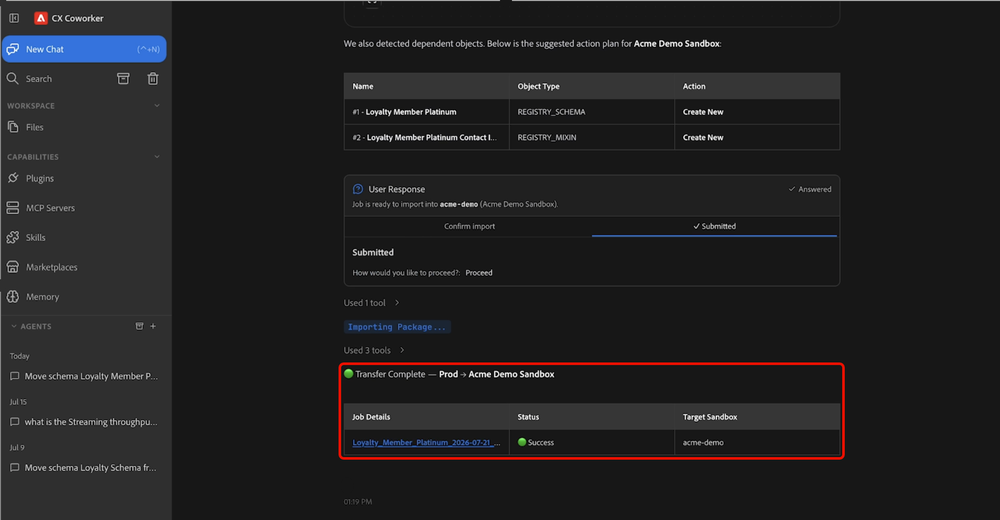

# Sandbox Tooling Agent Skills

>[!AVAILABILITY]
>
>Sandbox Tooling Agent Skills stehen allen Kunden mit Zugriff auf Adobe Coworker zur Verfügung. Um alle verfügbaren Funktionen zu verwenden, benötigen Sie die folgenden Berechtigungen:
>
>**Manage-sandbox** oder **View-sandbox**: Mit diesen Berechtigungen können Sie Sandbox Tooling Agent Skills verwenden, um Sandboxes direkt in Kollegen anzuzeigen.
>
>**Manage-package**: Mit dieser Berechtigung können Sie Sandbox Tooling Agent Skills verwenden, um Pakete direkt in Coworker zu erstellen.

>[!NOTE]
>
>Sie können derzeit Sandbox Tooling Agent Skills verwenden, um Schema- und Zielgruppenobjekte zu entdecken, zu verpacken und zu migrieren. In zukünftigen Versionen wird die Unterstützung für zusätzliche Objekttypen hinzugefügt.

Verwenden Sie die Agentenfertigkeiten der Sandbox-Werkzeuge, um Objektmetadaten - einschließlich Schemata und Zielgruppen - in Adobe Experience Platform-Umgebungen zu verschieben, indem Sie beschreiben, was Sie in natürlicher Sprache erreichen möchten. Mithilfe von Coworker können Sie die erforderlichen Metadaten ermitteln, Abhängigkeiten automatisch identifizieren, Migrationspakete erstellen und Objekte durch ein Gesprächserlebnis migrieren.

## Voraussetzungen {#prerequisites}

Bevor Sie beginnen, stellen Sie Folgendes sicher:

- Zugriff auf Adobe Experience Platform und die entsprechende Organisation und Sandbox.
- Zugriff auf die Objekte, die Sie suchen oder migrieren möchten.
- Das in Coworker installierte CRX-Plug-in für Adobe.

Anweisungen zum Installieren von Plug-ins finden Sie im [Handbuch zur Coworker-Benutzeroberfläche](https://experienceleague.adobe.com/de/docs/cx-enterprise-coworker/content/chat/ui-guide).

## Sandbox-Tools für agentische Fähigkeiten verwenden {#use-sandbox-tooling-agentic-skills}

Interagieren Sie mit Sandbox Tooling Agent Skills durch Kollegen mit natürlicher Sprache. Beschreiben Sie Ihr Ziel so klar wie möglich. Spezifische Anfragen liefern die besten Ergebnisse, während vage oder zu kurze Eingabeaufforderungen Ergebnisse von schlechterer Qualität zurückgeben oder den Agenten nicht aufrufen können.

So verwenden Sie Agentenfertigkeiten der Sandbox-Tools:

1. Navigieren Sie zu **[!UICONTROL CX Coworker]**.
1. Geben Sie eine klare Beschreibung dessen ein, was Sie erreichen möchten. Beispiel:

   *„Verschieben des Schema Loyalty Member Platinum aus der aktuellen Sandbox in die Sandbox der Acme-Demo“*

1. Überprüfen Sie die Ergebnistabelle, in der die Quell- und Ziel-Sandboxes angezeigt werden. Wenn Sie bereit sind, fortzufahren, klicken Sie auf **[!UICONTROL Fortfahren]** und wählen Sie dann **[!UICONTROL Senden]** aus, um fortzufahren.

   

1. Wählen Sie ein oder mehrere Objekte aus, die Sie migrieren möchten, und wählen Sie dann **[!UICONTROL Senden]**.

   

1. Überprüfen Sie die Objekte und Abhängigkeiten, die der Agent identifiziert, und bestätigen Sie die Aktionen des Vorgangs *Neu erstellen* oder *Vorhandene verwenden*. Wenn Sie bereit sind, die Migration zu starten, klicken Sie auf **[!UICONTROL Fortfahren]** und wählen Sie dann **[!UICONTROL Senden]** aus, um zu bestätigen. Es kann mehrere Minuten dauern, bis die Migration abgeschlossen ist.

   

1. Nach Abschluss der Migration sind die ausgewählten Objekte in der Ziel-Sandbox verfügbar.

Weitere Informationen zur Verwendung von Coworker finden Sie im [Handbuch zur Coworker-Benutzeroberfläche](https://experienceleague.adobe.com/de/docs/cx-enterprise-coworker/content/chat/ui-guide).

## Unterstützte Anwendungsfälle {#supported-use-cases}

Entdecken Sie gängige Möglichkeiten, Sandbox Tooling Agent Skills zu verwenden, um die Sandbox-Verwaltung und die Metadatenmigration zu vereinfachen.

### Verschieben von Objektmetadaten zwischen Sandboxes

Als Sandbox-Administrator, der mehrere Adobe Experience Platform-Sandboxes verwaltet, können Sie Objektmetadaten mithilfe von Anforderungen in natürlicher Sprache migrieren, anstatt manuell in der Benutzeroberfläche zu navigieren.

Mit Coworker können Sie Objektmetadaten - einschließlich Schemata, Zielgruppen und zugehörigen Konfigurations-Assets - von einer Sandbox in eine andere migrieren, indem Sie die Migration in natürlicher Sprache beschreiben. Sandbox Tooling Agent Skills identifizieren und verpacken automatisch die erforderlichen Abhängigkeiten, um eine zuverlässige Migration sicherzustellen.

Beispiel:

> „Verschieben Sie die Platin-Mitglieder des Schemas Luma Loyalty Members aus der aktuellen Sandbox in die Produktions-Sandbox.“

### Fördern von Zielgruppen zwischen Sandboxes

Als Sandbox-Administrator können Sie Zielgruppen zwischen Umgebungen weiterleiten, ohne sie manuell neu zu erstellen oder neu zu konfigurieren.

Beispiel:

> „Leiten Sie die Zielgruppe mit dem Zielgruppennamen in die Staging-Sandbox hoch.“

Sandbox Tooling Agent Skills identifizieren die angegebene Zielgruppe, validieren deren Abhängigkeiten und migrieren alle erforderlichen Objekte in die Ziel-Sandbox.

## Beispiel-Eingabeaufforderungen {#example-prompts}

Verwenden Sie die folgenden Eingabeaufforderungen als Beispiele für die Interaktion mit Sandbox Tooling Agent Skills.

### Eingabeaufforderungen im Schema

Verwenden Sie diese Eingabeaufforderungen, wenn Sie den Schemanamen und die Ziel-Sandbox kennen.

- „Verschieben des Schemas „Schemaname“ aus der aktuellen Sandbox in die Produktions-Sandbox.“

### Eingabeaufforderungen an die Zielgruppe

Verwenden Sie diese Eingabeaufforderungen, wenn Sie den Namen der Zielgruppe kennen.

- „Leiten Sie die Zielgruppe mit dem Zielgruppennamen in die Staging-Sandbox hoch.“

## Nächste Schritte {#next-steps}

Nach dem Lesen dieses Handbuchs sollten Sie wissen, wie Sie mit den Agentenfertigkeiten der Sandbox-Tools unterstützte Objekte zwischen Sandboxes finden, verpacken und migrieren können.

Weitere Informationen zum Sandbox-Tooling finden Sie im [Handbuch zum Sandbox-Tooling](https://experienceleague.adobe.com/de/docs/experience-platform/sandbox/ui/sandbox-tooling).
