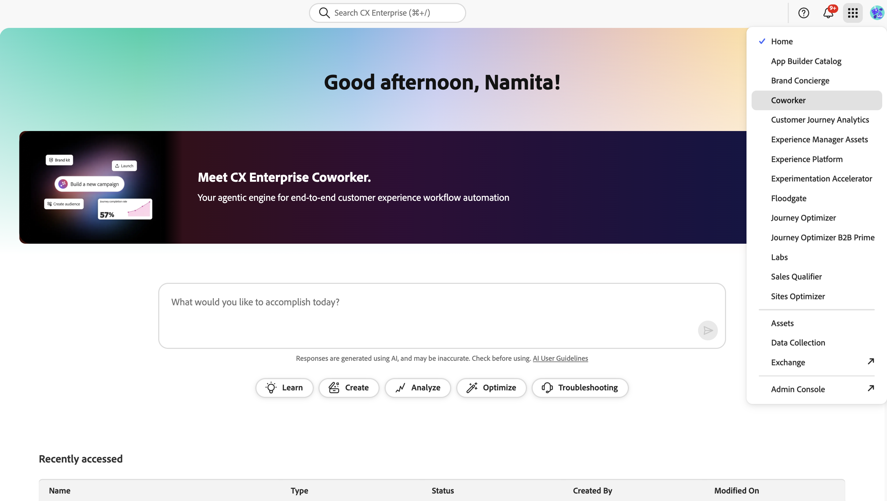

# CX Enterprise Coworker Trial

>[!AVAILABILITY]
>
>Bestimmte berechtigte CX Enterprise-Kunden haben möglicherweise Zugriff auf eine nutzungsgebundene Testversion, um den Wert der Agenten-KI-Angebote von Adobe in ihrer eigenen Umgebung zu erleben, bevor sie sich zum Kauf verpflichten.

Nach Ermessen von Adobe erhalten Kunden an der Testversion Zugriff auf **Coworker Chat**, eine Weiterentwicklung des KI-Assistenten-Gesprächserlebnisses. Der Coworker Chat ermöglicht es Teams, CXO-Produktaufgaben durch natürliche Sprache zu automatisieren und Ideen schnell in Aktionen mit flexibler Planung, anpassbaren Fähigkeiten und intelligenter Ausführung zu verwandeln.

Alle berechtigten Kundinnen und Kunden werden fortlaufend von KI-Assistent und Adobe Experience Platform-Agenten zu Coworker Chat umgestellt. In der Zwischenzeit behalten bestimmte Kunden möglicherweise den Zugriff auf den KI-Assistenten und die Experience Platform-Agenten, bis sie für den Coworker Chat aktiviert sind. Bitte beachten Sie, dass Co-Worker-Kampagnen nicht in den Umfang dieser Testversion fallen.

**KI-Assistent**: Eine ganzseitige, interaktive Gesprächsoberfläche, die von Agent Orchestrator unterstützt wird und produktübergreifend funktioniert. Damit können Anwender, die aktivierte CX Enterprise-Produkte verwenden, GenAI- und AgentAI-Funktionen nutzen. Weitere Informationen finden Sie im [Handbuch zur Benutzeroberfläche des KI-Assistenten](../ai-assistant/ai-assistant-ui.md).

**Adobe Experience Platform-Agenten**: Spezifische KI-Agenten, die in der Lage sind, gängige Aufträge über Kategorien von Customer Experience Domains hinweg bereitzustellen. Sie können Agenten nutzen, um Ihre Kapazität zu erweitern und Erlebnisse schneller und mit größerer Wirkung zu erstellen und bereitzustellen, wodurch Produktivität und Effizienz der nächsten Ebene erreicht werden. Um zu verstehen, welche Agenten mit jeder CX Enterprise-Anwendung genutzt werden können, lesen Sie die Dokumentation unter [Agent AI in CX Enterprise](../overview/agentic-ai.md).

## Details zum Testprogramm

Die Berechtigung des Kunden für die Testversion liegt vollständig im Ermessen von Adobe. Die Testversion steht Kundinnen und Kunden, die eine Lizenz für Experience Platform Agents AI Credits haben oder besaßen, nicht zur Verfügung.

Berechtigte Kunden erhalten eine einmalige Erstberechtigung von bis zu 10.000 KI-Credits zur Verwendung für:

- Kollege-Chat: Eingaben, die im Kollege-Chat eingegeben wurden. Für einen begrenzten Einführungszeitraum verbrauchen Eingänge KI-Credits mit einer Rate von 25 KI-Credits pro Eingabe. Dieser Tarif ist nur für begrenzte Zeit verfügbar und kann sich ändern.
- Experience Platform-Agenten: Jede Kombination von Aufträgen, die mit Experience Platform-Agenten ausgeführt werden (je nach Ihrer bestehenden Lizenz(en) für CX Enterprise-Anwendungen), aufgeführt in der [KI-Kreditverbrauchstabelle](../overview/ai-credit-consumption.md).

Sie können Ihre KI-Credits über das Lizenznutzungs-Dashboard in der Adobe Experience Platform-Benutzeroberfläche verfolgen. Weitere Informationen finden Sie in der [Dokumentation zum Lizenznutzungs-Dashboard](https://experienceleague.adobe.com/de/docs/experience-platform/dashboards/guides/license-usage).

Das Dashboard für die Überwachung der Agent-KI bietet einen klaren Überblick darüber, wie Agent-KI in Ihrer gesamten Organisation übernommen und verwendet wird. Autorisierte Benutzer können Interaktionen einfach verfolgen, Feedback einholen, die KI-Kreditnutzung überwachen und Schlüsselmetriken überprüfen. Nutzen Sie diese Einblicke, um Optimierungsmöglichkeiten zu entdecken und Ihre Governance- und Adoptionsbemühungen zu unterstützen. Weitere Informationen finden Sie im [Handbuch zur Überwachung der Nutzung von Agent AI](../overview/monitoring.md).

>[!IMPORTANT]
>
>- Die Testversion endet, wenn der Kunde die anfängliche einmalige Zuteilung von 10.000 KI-Credits nutzt oder separat eine Lizenz für zusätzliche KI-Credits erwirbt (je nachdem, was früher eintritt). KI-Credits sind nur für die Dauer des Testerlebnisses vorhanden und werden nicht verlängert, wenn der Kunde zusätzliche KI-Credits kauft, bevor er die volle Zuteilung von 10.000 KI-Credits für die Testversion verwendet.  Auch wenn der Kunde möglicherweise nicht sofort den Zugriff verliert oder Überschussbeträge in Rechnung gestellt werden, liegt die Verlängerung dieser Leistungen im Ermessen von Adobe. Der Kunde muss zusätzliche KI-Credits erwerben, sobald die Testversion abgeschlossen ist, um den Coworker Chat (oder Adobe Experience Platform-Agenten) ohne Unterbrechung weiter verwenden zu können.
>
>- Adobe behält sich das Recht vor, den Zugriff des Kunden auf den Coworker Chat (oder Adobe Experience Platform-Agenten) jederzeit und aus beliebigem Grund auszusetzen oder zu beenden. Adobe kann die Testversion nach eigenem Ermessen jederzeit widerrufen oder anderweitig ändern.

## Anleitung für den Zugriff

### Zugriff auf Coworker Chat

Benutzer zugelassener Kunden haben im Rahmen der Testversion Standardzugriff auf den Coworker Chat, sodass keine Aktion erforderlich ist. Der Coworker Chat arbeitet unter der Anleitung und Aufsicht von Benutzern und respektiert die vorhandenen Zugriffssteuerungen auf Produktebene Ihres Unternehmens. Benutzer können nur Aktionen ausführen, die sie bereits innerhalb der zugrunde liegenden CX Enterprise-Produkte ihres Unternehmens ausführen dürfen.

Benutzer können auf Mitarbeiter zugreifen, indem sie ihn in der Anwendungsauswahl in der oberen Kopfzeile von CX Enterprise auswählen.

Wenn eine Kundin oder ein Kunde den Zugriff ihres Unternehmens auf **Coworker Chat** widerrufen und/oder zu **AI Assistant** und **Experience Platform Agents** zurückkehren möchte, senden Sie eine Anfrage an [cx-coworker-questions@adobe.com](mailto:cx-coworker-questions@adobe.com).

Für Kunden, die noch nicht auf den Coworker Chat umgestellt wurden:

### Zugriff auf Experience Platform-Agenten über den von Agent Orchestrator unterstützten KI-Assistenten

Benutzer zugelassener Kunden haben im Rahmen der Testversion Standardzugriff auf KI-Assistenten und Agenten, sodass keine Aktion erforderlich ist. Experience Platform-Agenten orientieren sich an der Benutzereingabe und der Aufsicht. Agenten berücksichtigen auch zuvor definierte Zugriffssteuerungen auf Produktebene, sodass Benutzer nur Aufträge ausführen oder Aktionen ausführen können, für die sie über Berechtigungen in den entsprechenden zugrunde liegenden CX Enterprise-Produkten verfügen.

Sobald Sie Zugriff haben, navigieren Sie zur Startseite von Adobe CX Enterprise , um mit dem KI-Assistenten zu beginnen. Sie können die [Erkennungsaufforderungen“ verwenden](../ai-assistant/ai-assistant-ui.md#discovery-prompts) um Vorschläge für Aufforderungen und allgemeine Workflows anzuzeigen. Verwenden Sie diese Funktion, um das Onboarding mit dem KI-Assistenten zu beschleunigen. Lesen Sie außerdem die [Eingabeaufforderungsbibliothek](../ai-assistant/prompt-library.md), um eine Vielzahl von Eingabeaufforderungen anzuzeigen, die Sie mit verschiedenen Agenten verwenden können. Ausführlichere Informationen finden Sie im Handbuch [Benutzeroberfläche des KI-Assistenten](../ai-assistant/ai-assistant-ui.md).

Wenn der Kunde den Zugriff auf diese Agentenfunktionen deaktivieren und den Testzugriff deaktivieren möchte, senden Sie eine Anfrage an [cx-coworker-questions@adobe.com](mailto:cx-coworker-questions@adobe.com).

## Zusätzliche Ressourcen

Lesen Sie die folgenden Handbücher, um weitere Informationen zu Coworker, Agent Orchestrator und AI Assistant zu erhalten:

- [Kollegin](https://experienceleague.adobe.com/de/docs/cx-enterprise-ai/experience-cloud-ai/coworker/overview)
- [Übersicht über Agent Orchestrator](agent-orchestrator.md)
- [Handbuch zur Benutzeroberfläche des KI-Assistenten](../ai-assistant/ai-assistant-ui.md)
- [Bibliothek mit Eingabeaufforderungen des KI-Assistenten](../ai-assistant/prompt-library.md)
- [KI in CX Enterprise](../home.md)

## Häufig gestellte Fragen {#faq}

Im Folgenden finden Sie Antworten auf häufig gestellte Fragen zur Experience Platform Agents-Testversion.

### Was ist die Adobe Experience Platform Agents-Testversion?

Mit der nutzungsgebundenen Testversion für Agenten können berechtigte Kunden den Coworker Chat (oder ausgewählte Experience Platform-Agenten) ohne zusätzliche Kosten bis zu 10.000 KI-Credits verwenden. Das Ziel besteht darin, einen reibungsarmen, risikoarmen Weg zum Erlebniswert dieser Agenten zu bieten, bevor Kunden eine geschäftliche Entscheidung treffen.

### Welche Agenten sind in dieser Studie enthalten?

Eine vollständige Liste der in [&#x200B; Testversion enthaltenen Agenten finden Sie im Handbuch &#x200B;](../overview/agentic-ai.md)Agent-KI in CX Enterprise“.

### Wer kann an dieser Studie teilnehmen?

Die Testversion wird schrittweise für bestimmte berechtigte Adobe CX Enterprise-Kunden eingeführt, sodass Adobe angemessenen Support bereitstellen kann. Wenn Sie an einer Teilnahme interessiert sind, wenden Sie sich bitte an Ihr Adobe-Account-Team, das Ihren Status überprüfen und Zugriffsoptionen besprechen kann.

### Wie viele KI-Credits erhalte ich und was passiert, wenn diese KI-Credits verwendet werden?

Berechtigte Kunden erhalten bis zu 10.000 KI-Credits für die Testversion, die als Coworker Chat (oder Experience Platform-Agenten) verwendet werden, um Aufgaben auszuführen. Bitte beachten Sie, dass diese KI-Credits nur für die Dauer des Testerlebnisses existieren und nicht verlängert werden können, wenn Sie zusätzliche KI-Credits lizenzieren, bevor Sie die vollständigen 10.000 KI-Credits verwenden. Weitere Informationen zur Verwendung von KI-Krediten finden Sie im [Handbuch zu Agentenvorgängen und KI-Kreditkonsum](../overview/ai-credit-consumption.md).

### Kostet das irgendetwas?

Für diese Testversion ist kein zusätzlicher Kauf erforderlich. Es findet keine automatische Konvertierung in ein kostenpflichtiges Angebot statt. Wenn eine Kundin oder ein Kunde beschließt, den Coworker Chat (oder Experience Platform-Agenten) auch nach der Testversion zu verwenden, arbeitet das Adobe-Account-Team mit der Kundin bzw. dem Kunden zusammen, um zum kostenpflichtigen Angebot zu wechseln.

### Wer kann die Nutzung sehen und wie?

Sie können Ihre KI-Credits über das Lizenznutzungs-Dashboard in der Adobe Experience Platform-Benutzeroberfläche verfolgen. Weitere Informationen finden Sie in der [Dokumentation zum Lizenznutzungs-Dashboard](https://experienceleague.adobe.com/de/docs/experience-platform/dashboards/guides/license-usage). Verwenden Sie das Dashboard, um Ihre KI-Guthaben-Nutzung und -Berichte anzuzeigen. Nur Administratoren und Benutzer mit den entsprechenden Berechtigungen können Ihre Nutzungsinformationen anzeigen.

Kunden behalten die Kontrolle darüber, wer Nutzung und Reporting sehen kann. Nur Administratoren und Benutzer mit den entsprechenden Berechtigungen können diese Informationen sehen.

### Was passiert nach Ablauf des Prozesses?

Die Testversion endet, wenn Sie die anfängliche einmalige Berechtigung von bis zu 10.000 KI-Credits nutzen oder sobald Sie zusätzliche KI-Credits lizenzieren.

Nach Ablauf der Testversion haben Sie folgende Möglichkeiten:

- Nicht vorwärts bewegen
  - Zugriff auf die Testversion läuft ab.
  - Ihre bestehenden Adobe-Produkte funktionieren weiterhin wie bisher, ohne Strafen für die Nichtkonvertierung der Testversion
- Setzen Sie die Nutzung des Coworker Chat (oder des Experience Platform-Agenten) fort
  - Sie können mit Ihrem Adobe Account Team zusammenarbeiten, um auf ein kostenpflichtiges Angebot umzustellen.

Es gibt keinen automatischen ausgeblendeten Schalter, um Kunden zu konvertieren, deren Testversion beendet wurde, um bezahlt zu werden.
