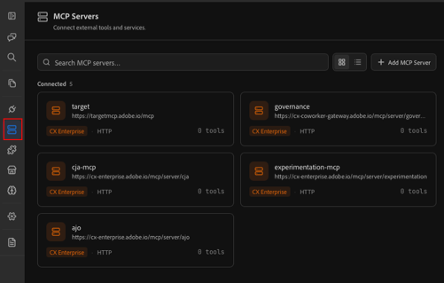

# Durchführen einer Customer Journey Analytics-Datenanalyse mit einem Kollegen

>[!AVAILABILITY]
>
>Die in diesem Artikel beschriebene Funktion befindet sich in der eingeschränkten Testphase der Veröffentlichung und ist möglicherweise noch nicht in Ihrer Umgebung verfügbar. Dieser Hinweis wird entfernt, wenn die Funktion allgemein verfügbar ist. Informationen zum Customer Journey Analytics-Veröffentlichungsprozess finden Sie unter [Customer Journey Analytics-Funktionsversionen](https://experienceleague.adobe.com/de/docs/analytics-platform/using/releases/latest).

Adobe CX Enterprise Coworker Chat kann erweiterte Datenanalysen durchführen, die zuvor nur in Analysis Workspace möglich waren. Der Coworker Chat greift auf Daten aus Ihren Customer Journey Analytics-Datenansichten zu, sodass Sie diese Daten untersuchen und Antworten auf Anfragen in natürlicher Sprache erhalten können.

Bevor Sie mit der Analyse beginnen, greifen Sie auf den Coworker chat zu, indem Sie sich bei Ihrem CX Enterprise-Konto anmelden und dann sicherstellen, dass der Customer Journey Analytics MCP-Server verbunden ist.

## Zugriff auf Coworker Chat

1. Navigieren Sie zu https://coworker.experience.adobe.io/chat/.

1. Melden Sie sich mit Ihren Adobe ID-Anmeldeinformationen bei ](https://experience.adobe.com)[Adobe CX Enterprise an.

1. Und was dann?

## Customer Journey Analytics MCP-Server verbinden

1. Wählen Sie in der linken Leiste von das Symbol MCP aus.

   

1. Stellen Sie sicher [!UICONTROL **dass „cja**] mcp“ in Ihrer Liste der verbundenen MCP-Server verfügbar ist.

   

1. (Bedingt) Wenn [!UICONTROL **cja-mcp**] noch nicht verbunden ist, wählen Sie [!UICONTROL **MCP-Server hinzufügen**], geben Sie cja im Feld [!UICONTROL **Server-Name**] an und wählen Sie es aus, wenn es angezeigt wird. Wählen Sie dann [!UICONTROL **Server hinzufügen**].

## Herstellen einer Verbindung zur rechten Datenansicht

<!--I did this. Do users need to?-->

Eine Datenansicht ist ein Container in Customer Journey Analytics, der bestimmt, wie Daten interpretiert werden.

Möglicherweise haben Sie Zugriff auf verschiedene Datenansichten in Customer Journey Analytics, die jeweils unterschiedliche Dimensionen und Metriken enthalten, die Coworker bei der Datenanalyse verwenden kann.

Teilen Sie Coworker mit, welche Fragen Sie beantwortet haben möchten, und fragen Sie, auf welche Datenansichten Sie Zugriff haben, damit Sie diese Informationen am besten bereitstellen können.

**Sie:**

>[!BEGINSHADEBOX]

Ich bin daran interessiert zu erfahren, wo Kunden auf der Kunden-Journey abbrechen. Auf welche Datenansichten in Customer Journey Analytics habe ich Zugriff, die diese Frage für mich beantworten können?

>[!ENDSHADEBOX]

**Chat-Antwort eines Kollegen:**

>[!BEGINSHADEBOX]

Sie haben Zugriff auf drei Datenansichten. Die `Customer lifecycle` Datenansicht enthält die folgenden Dimensionen und Metriken, die am besten für die Beantwortung Ihrer Frage geeignet sind.

>[!ENDSHADEBOX]

**Sie:**

>[!BEGINSHADEBOX]

Toll, verwenden wir diese Datenansicht.

>[!ENDSHADEBOX]

**Chat-Antwort eines Kollegen:**

>[!BEGINSHADEBOX]

Okay, ich werde die `Customer lifecycle` Datenansicht verwenden, um zukünftige Fragen in dieser Chat-Sitzung zu beantworten.

>[!ENDSHADEBOX]

## Anwendungsfall: Finden Sie heraus, wo Kunden abbrechen

Sie können Coworker Chat bitten, Ihre Daten zu verwenden, um geschäftliche Fragen zu analysieren.

Als Marketing-Manager, Merchandiser oder Wachstumsleiter möchten Sie vielleicht verstehen, wo Kundinnen und Kunden den Weg zum Kauf verlassen, warum sie ihn getan haben und was getan werden kann, um höhere Konversionsraten zu erzielen.

>[!NOTE]
>
>Die folgenden Abbildungen veranschaulichen Beispieldaten für einen fiktiven retailer, TechPulse Electronics, der verwendet wird, um die Form des Gesprächs zu zeigen.

### Die Arten von Fragen, die Sie stellen können

Sie müssen nicht wissen, was eine „Fallout-Visualisierung“ ist oder welche Metrik in welchen Slot passt. Beschreiben Sie stattdessen das Ergebnis, das Ihnen wichtig ist, in einfacher Sprache:

* „Wo verlieren wir Menschen auf dem Weg zum Kauf?“
* „Was ist meine vollständige Konversion von funnel, von der Produktansicht bis zum Checkout?“
* „Welche Marketing-Kanäle lecken am meisten zwischen Warenkorb und Kauf?“
* „Ist der Warenkorbabbruch auf Mobilgeräten oder Desktop-Computern schlimmer?“
* „Konvertieren Menschen aus Paid Social anders als Menschen aus E-Mails?“

### Das Gespräch

#### &#x200B;1. Beginnen Sie mit der Geschäftsfrage

**Sie:**

>[!BEGINSHADEBOX]

Wo verlieren wir Menschen auf dem Weg zum Kauf?

>[!ENDSHADEBOX]

**Chat-Antwort eines Kollegen:**

Beachten Sie, dass im Coworker Chat die richtige Visualisierung ausgewählt wird, die Touchpoints sequenziert und sogar empfohlene nächste Schritte hinzufügt.

>[!BEGINSHADEBOX]

Dies ist eine funnel-Frage. Lassen Sie mich die funnel-Konversion ausführen, um zu sehen, wo es auf dem Kaufpfad zu einer Abnahme kommt.

Hier verliert man Menschen:

| Funnel-Schritt | Anzahl | Konvertierung in nächste | Abbruch |
| --- | --- | --- | --- |
| Sessions | 137,476 | 45,0 % Produkt ansehen | 55% verlassen, ohne Produkte zu durchsuchen |
| Produktansichten | 61,845 | 55,0 % In den Warenkorb | 45 % durchsuchen, aber nicht hinzufügen |
| Hinzufügungen zum Warenkorb | 34,045 | 16,4 % Kauf | 83,6 % Warenkorbabbruch |
| Käufe | 5,582 | — | – |

**Die große Erkenntnis: Der zu kaufende Warenkorb ist Ihr größtes Leck**

28.463 Personen fügen Artikel zu ihrem Warenkorb hinzu, schließen den Kauf jedoch nie ab. Dies entspricht einer Abgaberate von 83,6 % bei Warenkorb - dem bei weitem größten Einzelfehler.

Um es in Dollar auszudrücken: Nur 10% mehr dieser Hinzufügungen zum Warenkorb würden etwa 2.846 Käufe hinzufügen. Auf der aktuellen Datenskala ist das potenziell ein erheblicher Umsatz, der noch auf dem Tisch liegt.

**Was dies über Prioritäten sagt:**

| Priorität | Problem | Opportunity-Umfang |
| --- | --- | --- |
| #1 | Warenkorbabbruch bei Kaufabbruch (Rückgang um 83,6 %) | 28.463 verlorene Käufer |
| #2 | Sitzung zur Produktansicht (55 % nie durchsuchen) | 75.631 Sitzungen ohne Produktinteraktion |
| #3 | Produktansicht zum Warenkorb (45 % fügen nicht hinzu) | 27.800 Interessierte, aber unverbindlich |

**Empfohlene nächste Schritte:**

1. Warenkorbabbruch nach Marketing-Kanal aufschlüsseln - Bringen bestimmte Kanäle Low-Intent-Traffic, der zum Warenkorb hinzukommt, aber nie kauft?
1. Betrachten Sie den Warenkorbabbruch nach Gerätetyp - Tötet die Reibung beim mobilen Checkout Konversionen?
1. Ermitteln Sie, welche Produkte am häufigsten aufgegeben werden - Preisproblem? Versand-Überraschung?

**Auf welche davon möchte ich als Nächstes eingehen?** Die Kanalaufschlüsselung würde Ihnen direkt mitteilen, welche Marketing-Aktionen Ihnen „fast-Käufer“ gegenüber tatsächlichen Käufern bringen.

>[!ENDSHADEBOX]

#### &#x200B;2. In das Leck bohren

**Sie:**

>[!BEGINSHADEBOX]

Okay, lassen Sie uns nach Marketing-Kanal aufschlüsseln

>[!ENDSHADEBOX]

**Chat-Antwort eines Kollegen:**

>[!BEGINSHADEBOX]

Es gibt eine benutzerdefinierte Dimension **Marketing** Kanal. Lassen Sie mich den funnel daran entnehmen, dann die Konversionsraten pro Kanal berechnen und feststellen, wo jeder Kanal undicht ist.

**Das Urteil: Das Leck ist nicht kanalspezifisch**

Das ist eine wirklich aufschlussreiche Erkenntnis. Hier finden Sie die Aufschlüsselung nach funnel pro Kanal:

| Kanal | Sessions | Zur Produktansicht | Zum Warenkorb hinzufügen | Zu erwerben | Konversion insgesamt | Umsatz/Sitzung |
| --- | --- | --- | --- | --- | --- | --- |
| Paid Search | 43,958 | 45.1% | 54.6% | 16.6% | 4.09% | $499.58 |
| Organische Suche | 31,492 | 44.9% | 54.9% | 16.9% | 4.17% | $494.76 |
| Direkt | 25,661 | 43.6% | 55.4% | 15.8% | 3.82% | $497.29 |
| E-Mail | 17,586 | 45.3% | 55.4% | 16.2% | 4.07% | $501.13 |
| Bezahlte Social Media | 12,684 | 45.4% | 55.7% | 16.0% | 4.03% | $512.17 |
| Anzeige | 6,511 | 45.3% | 55.7% | 16.2% | 4.09% | $501.45 |

**Wichtige Erkenntnisse:**

1. Die Abladung vom Warenkorb zum Kauf ist über alle Kanäle hinweg einheitlich schlecht (83-84 %). Das bedeutet, dass es nicht um die Traffic-Qualität geht - jeder Kanal liefert ähnlich engagierte Besucher. Das Leck liegt in Ihrem Checkout-Erlebnis selbst, nicht in Ihrem Marketing.
1. Kein Kanal ist bei der Konvertierung signifikant besser oder schlechter. Die Gesamtkonversionsraten liegen dicht zwischen 3,8 % und 4,2 %, und der Umsatz pro Sitzung ist nahezu identisch (495 - 512 $).
1. Wo die Auswirkungen auf das Volumen am wichtigsten sind: Die bezahlte Suche verliert die meisten Menschen in absoluten Zahlen (9.015 Warenkorbabbrüche), gefolgt von der organischen Suche (6.449 verloren). Dies sind die größten Chancen in Bezug auf den Wert eines Dollars, da sie den meisten Traffic verursachen.

**Was sagt Ihnen das strategisch**

Die Marketing-Kanäle machen ihren Job - sie alle bringen die Leute dazu sich zu interessieren und fügen zum Warenkorb zu ähnlichen Preisen hinzu. Das Problem liegt im Downstream des Marketings: Ihr Checkout und Zahlungsfluss ist dort, wo das Geld durchsickert.

**Empfohlene nächste Untersuchungen:**

1. Warenkorbabbruch nach Gerätetyp aufschlüsseln - Ist der mobile Checkout defekt oder frustrierend?
1. Sehen Sie, welche Produkte am häufigsten aufgegeben werden - gibt es eine Preis- oder Versandüberraschung an der Kasse?
1. Überprüfen Sie, ob die Kampagne „Holiday_flash_sale“ eine bessere Checkout-Konversion hatte - dringengesteuerte Kampagnen könnten die Checkout-Reibung überwinden.

**Welchen Blickwinkel möchten Sie als Nächstes untersuchen?**

>[!ENDSHADEBOX]

#### &#x200B;3. Weiter untersuchen

**Sie:**

>[!BEGINSHADEBOX]

Interessant. Versuchen wir, nach Gerätetyp aufzuschlüsseln.

>[!ENDSHADEBOX]

**Chat-Antwort eines Kollegen:**

>[!BEGINSHADEBOX]

**Gefunden: Der mobile Checkout ist defekt**

Der funnel ist geräteübergreifend bis zum Checkout identisch - dann fällt Mobile von einer Klippe:

| Gerät | Sessions | Zur Produktansicht | Zum Warenkorb hinzufügen | Zu erwerben | Konversion insgesamt |
| --- | --- | --- | --- | --- | --- |
| Desktop | 70,172 | 44.9% | 54.8% | 23.2% | 5.70% |
| Tablet | 14,149 | 44.7% | 55.6% | 14.3% | 3.56% |
| Mobile | 53,449 | 44.9% | 55.3% | 8.1% | 2.02% |

**Die Raucherpistole**

| Metrik | Desktop | Mobile | Lücke |
| --- | --- | --- | --- |
| Warenkorb zur Kaufrate | 23.2% | 8.1% | 15 Prozentpunkte |
| Mobile ist | – | 2,8fach schlechter | – |
| Transaktionsabbrüche | 13,274 | 12,178 | Nahezu das gleiche absolute Volumen |

Das Browsen und Hinzufügen zum Warenkorb funktioniert auf Mobilgeräten einwandfrei (identische Browser-Rate von ~45 %, ~55 % Quote von Hinzufügungen zum Warenkorb). Die Menschen sind gleichermaßen interessiert und engagiert. Aber irgendetwas im mobilen Checkout-Fluss bringt Konversionen zum Erliegen.

**Die Umsatzmöglichkeit**

Wenn die Mobile-Kasse mit derselben Rate wie die Desktop-PCs konvertiert würde, würden Sie ca. 1.991 zusätzliche Käufe erzielen - eine Steigerung des gesamten Kaufvolumens um 35 % durch die Behebung eines Erlebnisses.

**Was passiert wahrscheinlich**

Das Datenmuster (gleiches Engagement, katastrophaler Checkout-Rückgang) ist ein klassisches Signal für:

* Reibungsloser Ablauf von Zahlungsformularen auf kleinen Bildschirmen (Probleme beim automatischen Ausfüllen, Formular-Layout)
* Unerwartete Kosten an der Kasse (Versand, Steuer), die Aufkleber-Schock verursachen
* Gast-Checkout nicht verfügbar oder Anmeldewand auf Mobilgerät
* Seitenladeprobleme oder Zeitüberschreitungsprobleme bei der Zahlungsverarbeitung auf Mobilgeräten

**Empfohlene nächste Schritte:**

1. Aufschlüsselung des Verlassens des Warenkorbs auf Mobilgeräte nach Produktkategorie — Ist es bei teuren Artikeln (was auf Probleme mit dem Vertrauen in den mobilen Zahlungsverkehr hindeutet) schlechter?
1. Sehen Sie, welche Marketing-Kanäle den meisten mobilen Traffic verursachen - geben Sie dafür bezahlte Medienbudgets aus, um Leute in ein kaputtes mobiles funnel zu schicken?
1. Überprüfen Sie, ob ein Seiten- oder Site-Abschnittssignal vorliegt - können wir sehen, welche Checkout-Seiten mobile Benutzer zuletzt aufgerufen haben, bevor sie aufgeben?

**Welche möchten Sie untersuchen, oder reicht dieser Beweis, um ihn zu Ihrem UX- und Checkout-Team zu bringen?**

>[!ENDSHADEBOX]

#### &#x200B;4. Aus ihr eine Entscheidung machen

**Sie:**

>[!BEGINSHADEBOX]

Was soll ich also tun?

>[!ENDSHADEBOX]

**Customer Journey Analytics:**

>[!BEGINSHADEBOX]

Basierend auf dem, was die Daten zeigen, würde ich mich hier konzentrieren:

* **Reparieren Sie den mobilen Checkout - es ist kein Kanalproblem.** Jeder Kanal konvertiert Personen zu einem ähnlichen, gesunden Tempo in den Warenkorb, sodass die Anzeigenausgaben überall funktionieren. Der Umsatz geht insbesondere im Mobile-Checkout-Fluss verloren, in den die Fehlerbehebung gehört.
* **Beginnen Sie mit der Zahlung und Formularreibung.** Dies sind die häufigsten Gründe dafür, dass vorsätzliche Mobilkäufer ihren Warenkorb verlassen. Mobile Wallet-Optionen anzubieten und das Formular zu kürzen sind in der Regel die schnellsten Gewinne.
* **Überprüfen Sie nach der Behebung erneut.** Sobald die Checkout-Änderungen versendet werden, sollten Sie überprüfen, ob sich die Warenkorb-Kaufrate von Mobile auf die Desktop-Rate von 23,2 % zubewegt.

Soll ich das als Projekt speichern, damit Sie es verfolgen können, oder einen Warnhinweis einrichten, wenn der Kauf von Mobilgeräten per Warenkorb unter einen Schwellenwert fällt?

>[!ENDSHADEBOX]

### Was gerade passiert ist

Bei vier fremdsprachigen Fragen hat uns die Kollegin geholfen:

* Erstellen Sie eine mehrstufige Konversions-funnel und kennzeichnen Sie „Warenkorb-zu-Kauf“ als größtes Leck
* Marketing-Kanal als Ursache ausschließen - jeder Kanal sickerte fast mit der gleichen Rate durch
* Isolieren Sie das eigentliche Problem der mobilen Kasse und quantifizieren Sie die Fehlerbehebung bei einer Steigerung der Käufe um 35 %.
* Entscheiden Sie sich für eine Lösung, die Ihre Prioritäten setzt: mobiles Bezahlen und Formularkonflikte. Dies entspricht einer Konversionsrate von 23,2 % für Desktop-Computer

