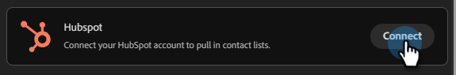
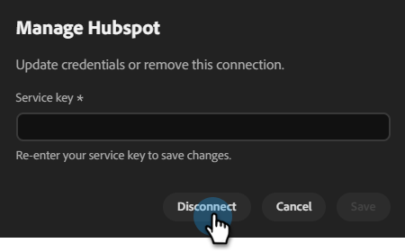

# Mit HubSpot verbinden {#hubspot}

Mit Adobe Coworker Campaign können Sie Ihr HubSpot-Konto verbinden, um Kontaktlisten abzurufen.

>[!PREREQUISITES]
>
>Um diesen Connector verwenden zu können, müssen Sie zunächst über Folgendes verfügen:
>
>* Ein aktives HubSpot-Konto
>* Ein [Dienstschlüssel](https://developers.hubspot.com/docs/apps/developer-platform/build-apps/authentication/account-service-keys#create-a-service-key) der mit den folgenden hinzugefügten Bereichen erstellt wurde: `crm.objects.contacts.read`, `crm.objects.leads.read`, `crm.schemas.contacts.read`, `crm.lists.read`, `crm.export`

## So verbinden Sie sich

1. Klicken Sie auf der [Startseite von &#x200B;](https://coworker-campaigns.experience.adobe.com/)-Kampagnen auf **Anpassen** und wählen Sie **Connectoren**.

   

1. Klicken Sie **Integration hinzufügen**.

   

   >[!NOTE]
   >
   >Wenn dies nicht Ihre erste Integration ist, lautet die Schaltfläche „Connector hinzufügen“.

1. Klicken Sie in der HubSpot-Zeile auf **Verbinden**.

   

1. Es wird ein Modal mit den erforderlichen Berechtigungen angezeigt (aufgeführt in den Voraussetzungen oben in diesem Artikel). Klicken Sie auf **Fortfahren**.

1. Geben Sie Ihren HubSpot **Service-Schlüssel** ein und klicken Sie auf **Verbinden**.

   

Nach der Verbindung wird HubSpot in der Connectoren-Liste angezeigt und kann beim Verknüpfen einer Kontaktliste mit HubSpot zur Synchronisierung ausgewählt werden.

**Verbindung trennen:**

1. Suchen Sie im Bildschirm „Connectoren“ die Kachel HubSpot und klicken Sie auf **Verwalten**.

   

1. Klicken Sie **Trennen** (Sie müssen Ihren Service-Schlüssel jetzt nicht erneut eingeben).

   

1. Klicken Sie **zur Bestätigung erneut** Trennen“.

   
