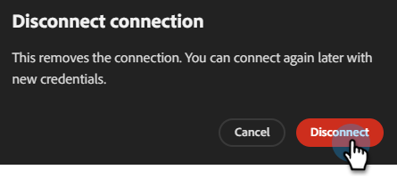

# Verbindung mit Marketo Engage herstellen {#marketo}

Mit Adobe Coworker-Kampagnen können Sie Ihr Marketo Engage-Konto verbinden, um intelligente und statische Listen abzurufen.

>[!PREREQUISITES]
>
>Um diesen Connector verwenden zu können, müssen Sie zunächst über Folgendes verfügen:
>
>* Ein gültiges Marketo Engage-Konto
>* Ihre Marketo **Instanz-URL**
>* Ein [benutzerdefinierter Service](https://experienceleague.adobe.com/en/docs/marketo-developer/marketo/rest/custom-services#custom-services-1) der für Coworker-Kampagnen in Marketo erstellt wurde, mit [Client-ID und &#x200B;](https://experienceleague.adobe.com/en/docs/marketo-developer/marketo/rest/authentication#creating-an-access-token) Client-Geheimnis)

## So verbinden Sie sich

1. Klicken Sie auf der [Startseite von &#x200B;](https://coworker-campaigns.experience.adobe.com/)-Kampagnen auf **Anpassen** und wählen Sie **Connectoren**.

   

1. Klicken Sie **Integration hinzufügen**.

   

   >[!NOTE]
   >
   >Wenn dies nicht Ihre erste Integration ist, lautet die Schaltfläche „Connector hinzufügen“.

1. Klicken Sie in der Marketo-Zeile auf **Verbinden**.

   

1. Geben Sie Ihre Marketo **Instanz-**, **Client-ID** und **Client-Geheimnis** ein. Klicken Sie auf **Verbinden**.

   >[!NOTE]
   >
   >Sie finden Ihre Marketo-Instanz-URL in der Adressleiste Ihres Browsers, wenn Sie Ihre Seite „Mein Marketo&quot; aufrufen.

   

Nach dem Verbinden wird Marketo in der Connectoren-Liste angezeigt und kann beim Verknüpfen einer Kontaktliste mit Marketo ausgewählt werden.

**Verbindung trennen:**

1. Suchen Sie im Bildschirm „Connectoren“ die Kachel Marketo und klicken Sie auf **Verwalten**.

   

1. Klicken Sie **Trennen** (Sie müssen Ihr Client-Geheimnis jetzt nicht erneut eingeben).

   

   >[!NOTE]
   >
   >Nachdem die Instanz-URL zum ersten Mal hinzugefügt wurde, wird standardmäßig die REST-Endpunkt-URL verwendet, die auf `*.mktorest.com` endet.

1. Klicken Sie **zur Bestätigung erneut** Trennen“.

   
