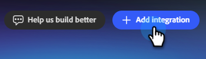
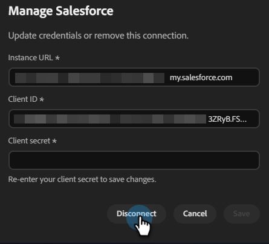

# Verbindung mit Salesforce herstellen {#salesforce}

Adobe Coworker Campaign ermöglicht es Ihnen, Ihr Salesforce-Konto mit…

>[!PREREQUISITES]
>
>Um diesen Connector verwenden zu können, müssen Sie zunächst über Folgendes verfügen:
>
>* Ein gültiges Salesforce-Konto
>* Die folgenden Berechtigungen in Salesforce: `api`, `sobjects.Contact.read`, `sobjects.Campaign.read`, `sobjects.CampaignMember.read`
>* Praktisch für die Salesforce[Instanz-URL, -Client-ID und -](https://help.salesforce.com/s/articleView?id=xcloud.remoteaccess_oauth_client_credentials_flow.htm&type=5#:~:text=DESCRIPTION-,client_id,-The%20consumer%20key)

## So verbinden Sie sich

1. Klicken Sie auf der [Startseite von &#x200B;](https://coworker-campaigns.experience.adobe.com/)-Kampagnen auf **Anpassen** und wählen Sie **Connectoren**.

   

1. Klicken Sie **Integration hinzufügen**.

   

   >[!NOTE]
   >
   >Wenn dies nicht Ihre erste Integration ist, lautet die Schaltfläche „Connector hinzufügen“.

1. Klicken Sie in der Salesforce-Zeile auf **Verbinden**.

   

1. Geben Sie Ihre Salesforce **Instanz-**, **Client-ID** und **Client-Geheimnis** ein. Klicken Sie auf **Verbinden**.

   >[!NOTE]
   >
   >* In Salesforce: Client ID = Consumer Key und Client Secret = Consumer Secret.
   >
   >* In Ihrem Salesforce-Konto finden Sie Ihre Instanz-URL in der Adressleiste Ihres Browsers oder indem Sie zu **Setup** > **Unternehmenseinstellungen** > **Meine Domain** navigieren.

   

Nach dem Verbinden wird Salesforce in der Connector-Liste angezeigt UND WAS NOCH EINMAL?

**Verbindung trennen:**

1. Suchen Sie im Bildschirm „Connectoren“ die Kachel Salesforce und klicken Sie auf **Verwalten**.

   

1. Klicken Sie **Trennen** (Sie müssen Ihr Client-Geheimnis jetzt nicht erneut eingeben).

   

1. Klicken Sie **zur Bestätigung erneut** Trennen“.

   
