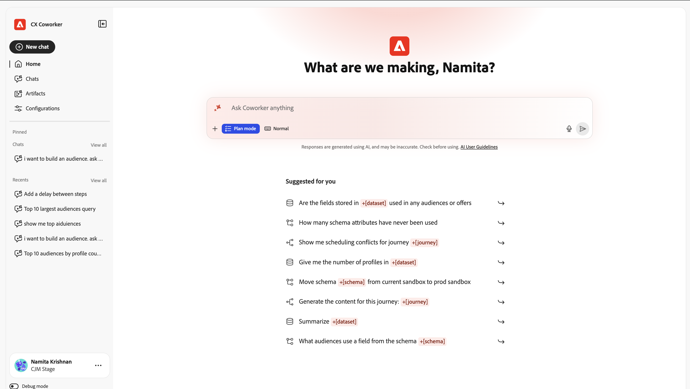
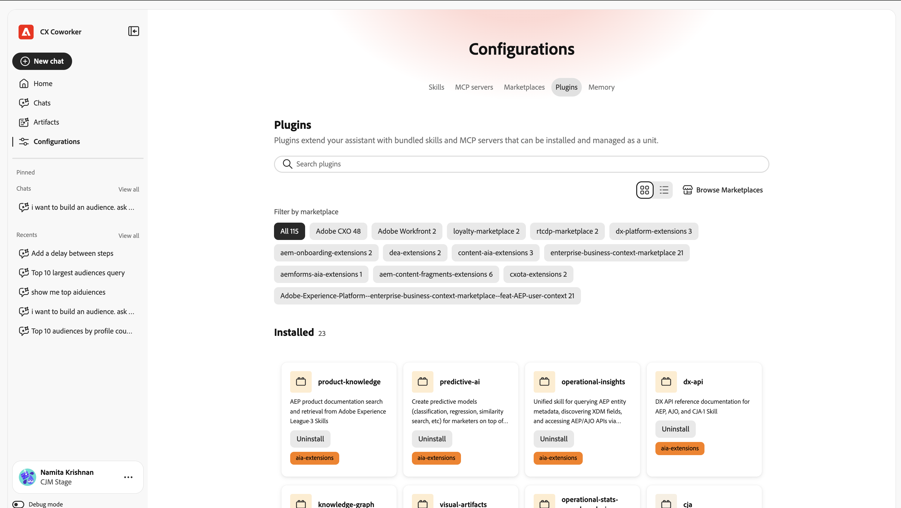

# Handbuch für die -Benutzeroberfläche {#ui-guide}

Orientieren Sie sich an der Oberfläche des Coworker Chat . In diesem Handbuch wird alles behandelt, vom Zugriff auf die App und der Navigation im Arbeitsbereich bis hin zur optimalen Nutzung von Unterhaltungen, der Verwaltung des Verlaufs und der Anpassung des Setups.

>[!VIDEO](https://video.tv.adobe.com/v/3498558?learn=on)

## Zugriff auf Coworker Chat

Greifen Sie auf den Coworker Chat zu, indem Sie zu [https://experience.adobe.com/#/coworker](https://experience.adobe.com/#/coworker) navigieren und sich mit Ihren Adobe-Anmeldeinformationen anmelden.

Sie können auch darauf zugreifen, indem Sie **Coworker** aus der Programmauswahl in der oberen Kopfzeile von CX Enterprise auswählen.

## Organisation und Sandbox auswählen

Ihr aktueller Kontext wird unten in der linken Navigationsleiste unter Ihrem Namen und Profilbild angezeigt. Der Kontext bestimmt, welche Daten, Fähigkeiten und verbundenen Tools eine Konversation erreichen kann. Bestätigen Sie dies also, bevor Sie beginnen.

Wählen Sie Ihren Namen aus, um das Kontomenü zu öffnen, in dem Sie den Kontext wechseln und die Workspace-Einstellungen ändern können:

| Element der Benutzeroberfläche | Beschreibung |
| --- | --- |
| Thema | Schnittstellendesign zwischen Hell und Dunkel umschalten. |
| Einstellungen | Öffnen Sie Workspace-Einstellungen , um Details zu Ihrem Konto und anderen Einstellungen anzuzeigen. |
| Organisationsauswahl | Wechseln Sie zwischen den IMS-Organisations-Workern, für die ausgeführt wird. |
| Sandbox-Auswahl | Wechseln Sie zur aktiven AEP-Sandbox. |
| CX-Anwendungen | Wechseln Sie zu einer anderen mit Ihrem Konto verbundenen CX Enterprise-Anwendung. |
| Abmelden | Melden Sie sich von Ihrem Adobe-Konto ab. |

## Navigieren in der Benutzeroberfläche

Die Benutzeroberfläche von CX Coworker besteht aus zwei Hauptbereichen: der Navigationsleiste auf der linken Seite und der Unterhaltungs-Arbeitsfläche, die den Rest des Fensters ausfüllt.

## Die Navigationsleiste

Über die Leiste haben Sie Zugriff auf alle Teile des Produkts und auf Ihre aktuellen Arbeiten.

| Element der Benutzeroberfläche | Beschreibung |
| --- | --- |
| Neuer Chat | Beginne eine neue Unterhaltung. Ihr aktueller Chat wird im Verlauf gespeichert. |
| Startseite | Kehren Sie zur Begrüßung, zum Eingabefeld und zu den empfohlenen Eingabeaufforderungen zurück. |
| Chats | Öffnen Sie den vollständigen Chatverlauf, um Konversationen zu suchen, anzuheften, zu archivieren oder zu löschen. |
| Konfigurationen | Kenntnisse, MCP-Server, Marketplaces, Plug-ins und Speicher verwalten |
| angeheftet | Gespräche, die Sie begonnen haben, befinden sich immer oben, um schnell darauf zugreifen zu können. Wählen Sie Alle anzeigen aus, um sie auf der Seite „Chats“ anzuzeigen. |
| Zuletzt ausgewertet | Ihre letzten Gespräche. Wählen Sie Alle anzeigen aus, um die Seite „Chats“ zu öffnen. |

## Der Startbildschirm

Der Startbildschirm ist der Ort, an dem Sie beginnen. Es zeigt eine personalisierte Begrüßung, das Eingabefeld und eine Reihe von empfohlenen Eingabeaufforderungen, die aus dem Coworker Chat entnommen wurden, um Ihnen in Ihrer Sandbox zu helfen.

### Empfohlene Eingabeaufforderungen

Unter Empfohlen für Sie listet CX Coworker Beispielaufgaben auf. Wählen Sie einen Vorschlag aus, um ihn in das Eingabefeld zu laden, und bearbeiten Sie ihn dann, bevor Sie ihn senden oder unverändert senden. Vorschläge sind eine schnelle Möglichkeit, die von Coworker Chat unterstützten Arten von Arbeit zu sehen: Verschieben von Schemas zwischen Sandboxes, Auffinden von Anomalien in einer Journey, Validieren eines Datensatzes und mehr.

### Erwähnungen der Entität

Empfohlene Eingabeaufforderungen und Ihre eigenen Nachrichten können mithilfe von Entitätsbeschriftungen wie +[schema], +[Journey] und +[dataset] auf bestimmte Objekte in Ihrer Sandbox verweisen. Eine Erwähnung einer Entität teilt Coworker Chat genau mit, welches Objekt Sie meinen, sodass Sie Ihre eigenen Erwähnungen hinzufügen können, indem Sie **+** eingeben.

## Das Eingabefeld für den Chat

Im Eingabefeld (mit der Beschriftung &#39;Alle Fragen an Kollegen&#39;) geben Sie Folgendes ein. Unter dem Textfeld befindet sich eine Symbolleiste für Anhänge, Antwortverhalten, Spracheingabe und Senden.

| Element der Benutzeroberfläche | Beschreibung |
| --- | --- |
| + (Anhängen) | Öffnen Sie das Menü Anhängen , um der Nachricht eine Datei oder ein Datenobjekt hinzuzufügen. |
| Planmodus | Bitten Sie den Coworker Chat, einen schrittweisen Plan vorzuschlagen und eine Pause zur Genehmigung einzulegen, bevor er aktiv wird. Schalten Sie sie aus, damit Coworker Chat direkt agieren kann. |
| Transkriptansicht | Legen Sie fest, wie viel von der internen Aktivität des Kollegen-Chats angezeigt wird: Normal, Fokus oder Verbose. |
| Mikrofon | Diktieren Sie Ihre Nachricht mit Spracheingabe. Zur Stoppung der Aufzeichnung erneut wählen. |
| Senden | Senden Sie die Nachricht. Während der Coworker Chat reagiert, wird dies zu einem Stopp-Steuerelement, das Sie verwenden können, um zu unterbrechen. |

### Anhängen von Dateien und Daten

Wählen Sie + aus, um Kontext an Ihre Nachricht anzuhängen:

- Datei anhängen: Laden Sie eine Datei hoch, die ein Mitarbeiter-Chat lesen und in seiner Antwort referenzieren kann.
- Daten oder Objekt hinzufügen: Referenzieren Sie ein Objekt aus Ihrer Sandbox, z. B. einen Datensatz oder ein Schema, sodass der Coworker Chat mit Ihren Live-Daten funktioniert.

### Planmodus

Aktivieren Sie den Planmodus, wenn eine Aufgabe komplex ist oder Daten ändert und Sie den Ansatz zuerst überprüfen möchten. Coworker Chat antwortet mit einem Plan und wartet auf Ihre Genehmigung, bevor Sie ihn ausführen. Wenn der Planmodus deaktiviert ist, fährt der Coworker Chat direkt mit der Arbeit fort.

### Transkriptansicht

Die Transkript-Ansicht legt fest, wie viel von der Logik und der Tool-Aktivität des Kollegen-Chats in der Konversation inline angezeigt wird:

| Element der Benutzeroberfläche | Beschreibung |
| --- | --- |
| Normal | Ausgewogene Sicht: Wichtige Denkschritte und Tool-Aktivitäten werden zusammengefasst. |
| Focus | Eine vereinfachte Ansicht, die die meisten Zwischenschritte ausblendet, sodass Sie hauptsächlich die Antwort sehen. |
| Verbose | Das ganze Detail: jeder denkende Schritt, jede Fähigkeit laden, Datei lesen und Abfrage. |

## Arbeiten mit Antworten

Wenn Sie eine Nachricht senden, durchläuft der Coworker Chat die Aufgabe im Offenen und gibt dann seine Antwort zurück. Eine Antwort kann Argumentation, eine Aufzeichnung der verwendeten Tools und ein oder mehrere Artefakte enthalten.

### Denken und Handeln

Während er funktioniert, zeigt der Coworker Chat, was er tut, damit Sie seinem Prozess folgen (und ihn überprüfen) können:

- Denkblöcke: ausblendbare Schritte mit der Beschriftung „Gedacht für“, gefolgt von der Anzahl der Sekunden (oder Millisekunden). Erweitern Sie eins, um die Argumentation des Kollegen-Chats zu lesen.
- Qualifikationsaktivität: Einträge wie „Geladene Qualifikation“ zeigen, welche spezialisierte Funktion Coworker Chat für die Aufgabe eingebracht hat.
- Datei- und Abfrageaktivität: Einträge wie „Datei lesen“ und „1 Abfrage ausführen“ zeichnen die Dateien, die der Coworker Chat gelesen hat, und die ausgeführten Abfragen auf, jeweils mit der Dauer.

>[!TIP]
>
>Verwenden Sie die ausführliche Transkriptansicht, um jeden Schritt anzuzeigen, oder den Fokus, um ihn auszublenden.

### Artefakte

Ergebnisse, die vom Coworker Chat erzeugt werden (z. B. eine Tabelle von Zielgruppen), werden als Artefaktkarten innerhalb der Antwort angezeigt. Von einer Artefaktkarte können Sie Tabellenartefakte als CSV-Datei herunterladen. Wenn eine Antwort mehrere Artefakte enthält, verwenden Sie die Karussellsteuerelemente (Zurück / Weiter und die Anzahl, z. B. 1 / 1), um zwischen ihnen zu wechseln.

### Analyse lesen

Unter den Artefakten fasst der Coworker Chat die Ergebnisse zusammen, hebt bemerkenswerte Ergebnisse hervor und schlägt mögliche Folgemaßnahmen vor.

### Feedback geben und Antworten kopieren

Jede Antwort verfügt über Steuerelemente zum Bewerten und Wiederverwenden:

- Daumen hoch / Daumen runter : Bewerten Sie die Antwort, um zukünftige Antworten zu verbessern.
- Kopieren: Kopieren Sie die Antwort mit Als Markdown kopieren (behält die Formatierung bei) oder Als Nur-Text kopieren .

## Chats verwalten

Wählen Sie in der Navigationsleiste Chats aus, um den vollständigen Verlauf zu öffnen. Unterhaltungen sind nach Datum gruppiert, und jede Zeile zeigt den Chat-Titel und wie viele Umdrehungen er enthält.

| Element der Benutzeroberfläche | Beschreibung |
| --- | --- |
| Nach Titel suchen | Finde ein vergangenes Gespräch mit Namen. |
| Angeheftete anzeigen | Nur die Gespräche anzeigen, die Sie gestartet haben. |
| Archivierte anzeigen | Zeigt archivierte Unterhaltungen an. |
| Neuer Chat | Beginne eine neue Unterhaltung. |
| Zeilenmenü (…) | Bei jeder Unterhaltung starten (PIN), umbenennen, archivieren oder löschen. |

## Konfigurationen

In den Konfigurationen können Sie anpassen, was der Coworker Chat tun kann. Es gibt fünf Registerkarten: Skills, MCP-Server, Marketplaces, Plugins und Memory.

### Skills

Kenntnisse sind spezialisierte Funktionen, die Coworker Chat automatisch aufruft, wenn sie relevant sind, oder die Sie selbst durch Eingabe von / im Chat Trigger machen können. Auf der Registerkarte Skills werden alle installierten Skills aufgelistet und Sie können weitere hinzufügen.

- Source hinzufügen: Kenntnisse aus einer neuen Quelle installieren.
- Suche: Suche nach einer Qualifikation anhand des Namens.
- Ansicht ändern: Wechseln zwischen Raster- und Listen-Layouts mithilfe des Umschalters Ansicht .

Wählen Sie eine Qualifikation aus, um ihre Details anzuzeigen: das Plug-in, zu dem sie gehört, eine Beschreibung, wann der Coworker Chat sie verwendet, und alle Dateien, die sie enthält. Wählen Sie Qualifikation anzeigen.md aus, um die vollständige Definition der Qualifikation zu lesen, oder entfernen Sie Source, um sie zu deinstallieren.

### MCP-Server

MCP-Server (Model Context Protocol) verbinden den Coworker Chat mit externen Tools und Services wie Adobe Journey Optimizer, Real-Time CDP, Target und Workfront. Auf der Registerkarte MCP-Server wird alles aufgelistet, was derzeit verbunden ist und wie viele Verbindungen aktiv sind.

- Server hinzufügen: Ein neues externes Tool oder einen neuen Service verbinden.

Jede Karte zeigt den Servernamen, den Endpunkt und alle Tags an, die beschreiben, was sie bereitstellt.

### Marketplaces

Marketplaces sind Registraturen von Plug-ins, die Sie durchsuchen und installieren können. Auf der Registerkarte Marketplaces können Sie Registrierungseinträge hinzufügen und nach Gruppe filtern.

- Marketplace hinzufügen: Registrieren eines neuen Plug-in-Marketplace.
- Suche/Filtern nach Gruppe: Engen Sie die Liste ein, um einen Marktplatz zu finden.

Jeder Marketplace zeigt seine Quelle und den Status Bereit an, sobald er zur Installation über verfügbar ist.

### Plug-ins

Plug-ins erweitern den Coworker Chat mit gebündelten Fähigkeiten und MCP-Servern, die gemeinsam als Einheit installiert und verwaltet werden. Die Registerkarte Plug-ins zeigt, was installiert ist, und ermöglicht das Hinzufügen weiterer Inhalte aus Ihren Marketplaces.

- Marktplätze durchsuchen: neue Plug-ins zur Installation finden.
- Deinstallieren: Entfernen Sie ein installiertes Plug-in und alles, was es enthält.
- Nach Marketplace filtern: Ermitteln Sie, welche Plug-ins aus welcher Registrierung stammen.

### Speicher

Mit dem Arbeitsspeicher können Sie Ihre Präferenzen in allen Konversationen speichern, damit die Antworten im Laufe der Zeit relevant und persönlich bleiben.

- Speicher aktivieren: Schaltet den sitzungsübergreifenden Speicher ein oder aus.
- Gespeicherte Voreinstellungen: die Voreinstellungen, die der Kollege-Chat gelernt und gespeichert hat. Jeder Eintrag kann bearbeitet, gelöscht oder überprüft werden, und die Einträge können nach Kategorie gefiltert werden.
- Verlauf gespeicherter Erinnerungen: eine Zeitleiste der Änderungen an den gespeicherten Erinnerungen.

