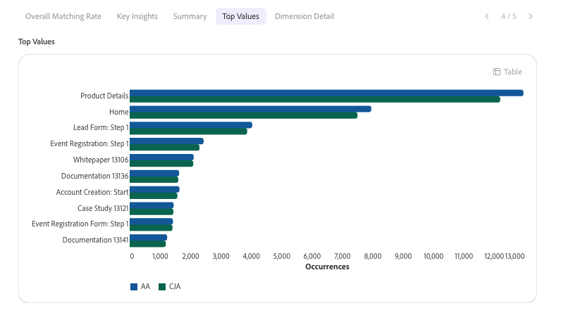

# Analysieren von Daten mit dem Kollegen-Chat

Die Informationen auf dieser Seite bieten einen Überblick über den Adobe CX Enterprise Coworker-Chat und wie er Ihnen bei der Analyse von Daten für Ihr Unternehmen helfen kann.

Der Coworker Chat ermöglicht es Teams, Adobe-Produktaufgaben mithilfe natürlicher Sprache zu automatisieren und Ideen schnell in Maßnahmen mit flexibler Planung, anpassbaren Fähigkeiten und intelligenter Ausführung zu verwandeln. Weitere allgemeine Informationen zu Kollegen finden Sie unter [Übersicht über CX Enterprise Coworker](/help/coworker/overview.md).

## Funktionsweise der Datenanalyse

Coworker Chat kann erweiterte Datenanalysen durchführen, die zuvor nur in Analysis Workspace möglich waren. Der Coworker Chat greift auf Daten aus Ihren Customer Journey Analytics-Datenansichten oder Adobe Analytics-Report Suites zu, sodass Sie Daten untersuchen und Antworten mit Eingabeaufforderungen in natürlicher Sprache erhalten können.

Wenn Sie eine Visualisierung im Coworker Chat erstellen, können Sie sie jederzeit in Analysis Workspace öffnen, um eine manuelle Kontrolle zu erhalten.

## Analysieren im Kollegen-Chat beginnen

Beginnen Sie, indem Sie beschreiben, was Sie wissen möchten, in einfacher Sprache. Der Coworker Chat plant die Analyse, fragt Ihre Datenansichten oder Report Suites ab und erstellt Visualisierungen und Zusammenfassungen.

Die folgenden Anwendungsfälle sind nach dem gruppiert, was Sie erreichen möchten. Jede Gruppe listet die Rollen auf, für die sie am besten geeignet ist.

### Leistung messen

**Am besten geeignet für:** Analyst, Business-Anwender

| Anwendungsfall | Funktion |
| --- | --- |
| [Analysieren von Customer Journey Analytics- und Adobe Analytics-Daten](/help/coworker/chat/use-cases/data-insights/analytics-chat.md)

 | Beantwortet Fragen in natürlicher Sprache zu Ihren Datenansichten oder Report Suites, erstellt Trichter und andere Visualisierungen und findet heraus, wo Kunden abbrechen. Sie können eine beliebige Visualisierung in Analysis Workspace zur weiteren Analyse öffnen.
Weitere Informationen finden Sie unter [Analysieren von Adobe CX Analytics-Daten mit dem Coworker Chat](/help/coworker/chat/use-cases/data-insights/analytics-chat.md).
 |
| [Leistung vergleichen](/help/coworker/chat/use-cases/data-insights/analytics-chat.md#query-and-analyze-data) | Vergleichen Sie Metriken kanalübergreifend, über Zeiträume hinweg oder segmentübergreifend.
Weitere Informationen finden Sie unter [Abfragen und Analysieren von Daten](/help/coworker/chat/use-cases/data-insights/analytics-chat.md#query-and-analyze-data) in Analysieren von Adobe CX Analytics-Daten mit dem Coworker Chat.
 |
| [Kampagnenleistung messen](/help/coworker/chat/use-cases/overview.md#data-insights) | Sehen Sie, wie Kampagnen, Kanäle und Web-Eigenschaften über einen bestimmten Zeitraum ausgeführt wurden.
Weitere Informationen finden Sie unter [Dateneinblicke](/help/coworker/chat/use-cases/overview.md#data-insights) in Anwendungsfällen für den Coworker Chat.
 |
| [Analysieren von Trichtern](/help/coworker/chat/use-cases/data-insights/analytics-chat.md#query-and-analyze-data) | Gehen Sie durch mehrstufige Konversionstrichter und sehen Sie sich den Abbruch in jedem Stadium an.
**Am besten geeignet für:** Analyst

Weitere Informationen finden Sie unter [Abfragen und Analysieren von Daten](/help/coworker/chat/use-cases/data-insights/analytics-chat.md#query-and-analyze-data) in Analysieren von Adobe CX Analytics-Daten mit dem Coworker Chat.
 |

### Finden Sie heraus, warum sich Metriken geändert haben

**Am besten geeignet für:** Analyst

| Anwendungsfall | Funktion |
| --- | --- |
| [Erkunden von Trends und Grundursachen](/help/coworker/chat/use-cases/data-insights/root-cause-analysis.md)

 | Identifiziert Trends in Ihren Customer Journey Analytics- und Adobe Analytics-Daten und die Faktoren, die zu Leistungsänderungen führen, ohne manuelle Abfragen.
Weitere Informationen finden Sie unter [Customer Journey Analytics &amp; Coworker](/help/coworker/chat/use-cases/data-insights/root-cause-analysis.md).
 |
| [Analyse operativer Trends und Ursachen](/help/coworker/chat/use-cases/overview.md#data-insights) | Abfragen historischer Zeitreihendaten für Zielgruppen, Datensätze und Journey und Identifizieren, was eine Änderung verursacht hat.
**Am besten geeignet für:** Admin, Analyst

Weitere Informationen finden Sie unter [Dateneinblicke](/help/coworker/chat/use-cases/overview.md#data-insights) in Anwendungsfällen für den Coworker Chat.
 |

### Prognostizieren der zukünftigen Leistung

**Am besten geeignet für:** Analyst

| Anwendungsfall | Funktion |
| --- | --- |
| [Prognosemetriken](/help/coworker/chat/use-cases/data-insights/analytics-chat.md#query-and-analyze-data) | Projizieren Sie zukünftige Metrikwerte aus historischen Customer Journey Analytics- oder Adobe Analytics-Daten, z. B. ob Sie auf dem richtigen Weg sind, um ein Umsatzziel zu erreichen.
Weitere Informationen finden Sie unter [Abfragen und Analysieren von Daten](/help/coworker/chat/use-cases/data-insights/analytics-chat.md#query-and-analyze-data) in Analysieren von Adobe CX Analytics-Daten mit dem Coworker Chat.
 |

### Austausch von Einblicken mit Stakeholdern

**Am besten geeignet für:** Analyst, Business-Anwender

| Anwendungsfall | Funktion |
| --- | --- |
| [Erstellen von Zusammenfassungen und KPI-Übersichten](/help/coworker/chat/use-cases/data-insights/analytics-chat.md#executive-summaries-and-performance-digests) | Erstellen Sie für die Stakeholder geeignete Leistungszusammenfassungen, Empfehlungen und Folienübersichten.
Weitere Informationen finden Sie unter [&#x200B; und Leistungsübersichten &#x200B;](/help/coworker/chat/use-cases/data-insights/analytics-chat.md#executive-summaries-and-performance-digests) Analysieren von Adobe CX Analytics-Daten mit dem Coworker Chat.
 |

### Implementierung oder Upgrade planen

**Am besten geeignet für:** Admin

| Anwendungsfall | Funktion |
| --- | --- |
| [Implementierung planen](/help/coworker/chat/use-cases/data-insights/implementation-guide.md)

 | Erstellt einen personalisierten, schrittweisen Plan für die Implementierung von Customer Journey Analytics, die Aktualisierung von Adobe Analytics oder die Einrichtung von Content Analytics, Marketing Campaign Analytics oder Streaming Media Collection auf der Edge. Die Pläne enthalten Details wie Eigentümer, Aufwandsschätzungen, Abhängigkeiten und Validierungsschritte.
Weitere Informationen finden Sie unter [Implementierung mit Coworker planen](/help/coworker/chat/use-cases/data-insights/implementation-guide.md).
 |
| [Erstellen einer Checkliste für die Implementierung](/help/coworker/chat/use-cases/data-insights/intelligent-checklist.md)

 | Wandelt Ihren Customer Journey Analytics-Implementierungsplan in eine Checkliste in Co-Worker-Projekten um, in der Ihr Team Schritte zuweisen, den Status verfolgen und Validierungs-Gates hinzufügen kann.
Weitere Informationen finden Sie unter [Generieren einer Implementierungsprüfliste mit Co-Worker-Projekten](/help/coworker/chat/use-cases/data-insights/intelligent-checklist.md).
 |

### Vergewissern Sie sich, dass Ihre Daten korrekt sind

**Am besten geeignet für:** Admin

| Anwendungsfall | Funktion |
| --- | --- |
| [Validieren von Daten beim Upgrade von Adobe Analytics auf Customer Journey Analytics](/help/coworker/chat/use-cases/data-insights/data-validation-aa-cja.md)

 | Vergleicht Dimensionen, Metriken und Trends zwischen Ihren Adobe Analytics Report Suites und Customer Journey Analytics-Datenansichten und empfiehlt dann Fehlerbehebungen, um Ihr Upgrade zu unterstützen.
**Am besten geeignet für:** Admin, Analyst

Weitere Informationen finden Sie unter [Validieren von Daten mit einem Kollegen beim Upgrade von Adobe Analytics auf Customer Journey Analytics](/help/coworker/chat/use-cases/data-insights/data-validation-aa-cja.md).
 |
| [Validieren der Implementierung von Streaming-Medien](/help/coworker/chat/use-cases/data-insights/streaming-media-validation.md)

 | Überprüft Ihren Datenstrom, Ihr Schema, Ihren Datensatz, Ihre Datenansicht und Ihre Sitzungsdaten, um sicherzustellen, dass das Tracking von Streaming-Medien konfiguriert ist und die Daten korrekt erfasst werden.
Weitere Informationen finden Sie unter [Validieren der Implementierung von Streaming-Medien mit Coworker](/help/coworker/chat/use-cases/data-insights/streaming-media-validation.md).
 |
| [Validieren der Datensatzqualität für Customer Journey Analytics](/help/coworker/chat/use-cases/data-insights/validate-dataset-quality-for-cja.md)

 | Identifiziert die Datensätze, die Ihre Customer Journey Analytics-Berichte unterstützen, prüft dann Schemata, Identitätsqualität und Feldqualität, damit Sie Probleme beheben können, bevor Sie Dashboards erstellen.
Weitere Informationen finden Sie unter [Validieren von Customer Journey Analytics-Daten mit der Datenvalidierungsfertigkeit in Coworker](/help/coworker/chat/use-cases/data-insights/validate-dataset-quality-for-cja.md).
 |
| [Validieren von Daten nach der Aufnahme in Experience Platform](/help/coworker/chat/use-cases/data-insights/data-validation-aep.md)

 | Führt statistische und semantische Prüfungen für Experience Platform-Datensätze und -Felder durch, um Probleme mit der Datenqualität zu ermitteln, z. B. ungültige Werte oder Zuordnungsprobleme.
Weitere Informationen finden Sie unter [Validieren Ihrer Experience Platform-Daten mit Coworker](/help/coworker/chat/use-cases/data-insights/data-validation-aep.md).
 |

### Automatisieren von Analysen, die Sie wiederholen

**Am besten geeignet für:** Analyst

| Anwendungsfall | Funktion |
| --- | --- |
| [Erstellen benutzerdefinierter Customer Journey Analytics-Kenntnisse](/help/coworker/chat/use-cases/data-insights/analytics-chat.md#create-custom-skills) | Wandeln Sie eine Analyse, die Sie wiederholen, in eine wiederverwendbare Fähigkeit um, die sitzungsübergreifend bestehen bleibt.
Weitere Informationen finden Sie unter [Erstellen benutzerdefinierter Fähigkeiten](/help/coworker/chat/use-cases/data-insights/analytics-chat.md#create-custom-skills) in Analysieren von Adobe CX Analytics-Daten mit dem Coworker Chat.
 |

Weitere Informationen zu diesen Anwendungsfällen, einschließlich der von ihnen verwendeten Fähigkeiten und Beispielaufforderungen, finden Sie unter [Anwendungsfälle für Dateneinblicke](/help/coworker/chat/use-cases/overview.md#data-insights).

