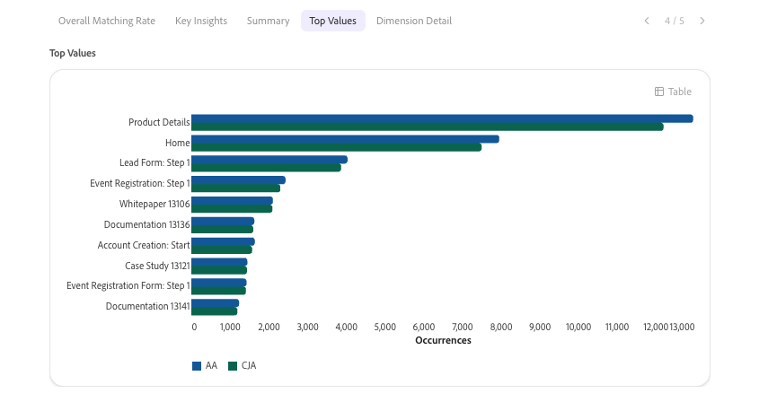

# Validieren von Daten mit einem Kollegen beim Upgrade von Adobe Analytics auf Customer Journey Analytics

>[!NOTE]
> 
>Befolgen Sie die Schritte auf dieser Seite erst, nachdem Sie alle vorherigen Upgrade-Schritte abgeschlossen haben. Sie können die empfohlenen Upgrade-Schritte (empfohlen für die meisten Unternehmen) oder die für Ihr Unternehmen dynamisch generierten Schritte mit dem Customer Journey Analytics Upgrade Guide ausführen. <ul><li>**Empfohlene Upgrade-Schritte** (für die meisten Unternehmen empfohlen)
Eine Reihe von Schritten, die zu einer optimalen Customer Journey Analytics-Implementierung führen.

Detaillierte Informationen finden Sie unter [Upgrade von Adobe Analytics auf Customer Journey Analytics](https://experienceleague.adobe.com/de/docs/analytics-platform/using/compare-aa-cja/upgrade-to-cja/cja-upgrade-recommendations).
</li><li>**Customer Journey Analytics-Aktualisierungshandbuch** (Benutzerdefinierte Schritte, die auf die spezifischen Anforderungen Ihres Unternehmens zugeschnitten sind)
Es ist ein neues Upgrade-Handbuch verfügbar, in dem dynamisch Upgrade-Schritte generiert werden, die für Ihr Unternehmen und Ihre individuellen Bedingungen maßgeschneidert sind.

Um über Customer Journey Analytics auf das Handbuch zuzugreifen, wählen Sie die Registerkarte **[!UICONTROL Workspace]** und dann **[!UICONTROL Upgrade auf Customer Journey Analytics]** im linken Bereich aus. Befolgen Sie die Anweisungen auf dem Bildschirm.
</li></ul>

Der -Mitarbeiter verfügt über eine Validierungsfertigkeit, mit der Sie Daten beim Upgrade von Adobe Analytics auf Customer Journey Analytics validieren können. Die Datenvalidierung wird in einer einzigen Konversation abgeschlossen.

Diese Qualifikation vergleicht automatisch:

* Jede Dimension, jede Metrik und jeder Trend einzeln über Implementierungen hinweg.

* Alle Adobe Analytics Report Suites für alle Customer Journey Analytics-Datenansichten.

Nach diesen Vergleichen generiert die Qualifikation KI-gesteuerte Einblicke und Empfehlungen, die Sie implementieren können, um Ihr Upgrade auf Customer Journey Analytics zu erleichtern.

## Voraussetzungen

Zur Datenvalidierung im Rahmen des Upgrades benötigen Sie Folgendes:

* Die Adobe Analytics Report Suite, die Sie validieren möchten.

* Die Customer Journey Analytics-Datenansicht, die dieselben Daten enthält.

Sie müssen nicht wissen, wie Ihre Implementierung aufgebaut ist. Die Qualifikation erkennt automatisch, ob Ihre Customer Journey Analytics-Implementierung den Analytics Source Connector oder eine neue Implementierung der Experience Platform Web SDK verwendet.

## Starten einer Validierungssitzung

1. Melden Sie sich bei Coworker an.

1. Wählen Sie [!UICONTROL **Neuer Chat**] aus.

1. Fordern Sie den Agenten im Textfeld auf, Ihr Upgrade von Adobe Analytics auf Customer Journey Analytics zu validieren:

   **Eingabeaufforderung**

   > Helfen Sie mir, das Upgrade meines Unternehmens von Adobe Analytics auf Customer Journey Analytics zu validieren.

   Ihre Anfrage wird an die Datenvalidierungsfertigkeit weitergeleitet, die einen interaktiven Einrichtungsprozess startet.

1. Wählen Sie für jede Frage im Einrichtungsprozess eine Antwort aus und klicken Sie dann auf [!UICONTROL **Senden**].

   Der Einrichtungsprozess umfasst die Fragen in der folgenden Tabelle.

   >[!NOTE]
   >
   >Sie können jede dieser Auswahlmöglichkeiten später im selben Gespräch ändern. Bitten Sie beispielsweise den Agenten, Ihre Report Suite oder Datenansicht zu ändern, und der Agent wiederholt nur die Schritte, die zum Aktualisieren dieser Auswahl erforderlich sind, ohne den gesamten Einrichtungsprozess neu zu starten.

   | Question | Zusätzlicher Kontext |
   |---------|----------|
   | [!UICONTROL **Wählen Sie Ihr Analytics-Unternehmen aus**] | Dies ist Ihr Adobe Analytics-Anmeldeunternehmen. |
   | [!UICONTROL **Report Suite auswählen**] <!--In the UI, recommend change to "Select your Adobe Analytics report suite"--> | Dies ist die Report Suite in Adobe Analytics, die die Daten enthält, die Sie mit den Customer Journey Analytics-Daten überprüfen möchten. |
   | [!UICONTROL **Customer Journey Analytics-Datenansicht auswählen**] | Dies ist die Datenansicht in Customer Journey Analytics, die dieselben Daten enthält wie die von Ihnen ausgewählte Adobe Analytics Report Suite. |

1. Überprüfen Sie die Setup-Zusammenfassung, um zu bestätigen, dass Sie die richtigen Daten validieren, bevor Sie fortfahren.

   Die Zusammenfassung enthält das ausgewählte Unternehmen, die Report Suite und die Datenansicht sowie eine Vorschau der wichtigsten Metriken und Dimensionen in jedem System.

1. Fahren Sie mit dem folgenden Abschnitt fort: [Wählen Sie die zu validierenden Daten aus](#choose-the-data-to-validate).

## Zu validierende Daten auswählen

Sie können einzelne Metriken oder Dimensionen oder alle Metriken und Dimensionen überprüfen, die in der Report Suite und Datenansicht enthalten sind.

1. Wählen Sie aus den folgenden Optionen aus:

   | Validierungsoption | Beschreibung |
   |---------|----------|
   | [!UICONTROL **Vergleich einzelner Metriken**] | Vergleichen Sie den Trend einer Metrik zwischen Adobe Analytics und Customer Journey Analytics. Verwenden Sie diese Option, wenn Sie eine schnelle Prüfung einer bestimmten Metrik wünschen, z. B. Seitenansichten oder Besuche. |
   | [!UICONTROL **Vergleich einzelner Dimensionen**] | Vergleichen Sie die Aufschlüsselung einer Dimension zwischen Adobe Analytics und Customer Journey Analytics. Verwenden Sie diese Option, wenn Sie eine Zuordnungs- oder Klassifizierungsdifferenz für eine bestimmte Dimension vermuten. |
   | [!UICONTROL **Audit „Vollständige Report Suite und Datenansicht“**] | Vergleichen Sie in einem Durchgang bis zu 40 Adobe Analytics-Metriken und 20 Dimensionen mit ihren Customer Journey Analytics-Gegenstücken. Verwenden Sie diese Option, wenn Sie einen umfassenden Überblick über den Gesamtzustand Ihres Upgrades erhalten möchten. |

1. Fahren Sie mit dem folgenden Abschnitt fort: [Analyse überprüfen](#review-the-analysis).

## Analyse überprüfen

1. Wählen Sie die Registerkarte [!UICONTROL **Gesamtabgleichrate**], um einen Prozentsatz anzuzeigen, der angibt, wie stark die Daten aus der Adobe Analytics Report Suite mit denen der Customer Journey Analytics-Datenansicht übereinstimmen.

   Dieser Wert wird immer zuerst angezeigt, vor allen anderen Ergebnissen. Er wiegt jede verglichene Metrik und Dimension gleich, um sicherzustellen, dass Metriken mit hohem Volumen, wie Seitenansichten, den Score nicht verfälschen.

   Verwenden Sie die folgende Skala, um die Bewertung zu interpretieren:

   | Ergebnis | Rating | Bedeutung |
   |---------|----------|----------|
   | 97 %-100 % |  [!UICONTROL Hervorragend] | Alle Eigenschaften sind hochgradig ausgerichtet. Keine Aktion erforderlich. |
   | 90 %-96 % |  [!UICONTROL Gut] | Geringfügige Lücken sind vorhanden. Trends überwachen und untersuchen, ob sie abnehmen. |
   | 75 %-89 % |  [!UICONTROL review] | Es gibt bedeutende Lücken. Untersuchen Sie die Grundursachen, bevor Sie Customer Journey Analytics-Daten verwenden. |
   | Weniger als 75 % |  [!UICONTROL Schlecht] | Deutliche Fehlausrichtung. Ergreifen Sie sofort Maßnahmen, bevor Sie Customer Journey Analytics-Daten verwenden. |

1. Wählen Sie die Registerkarte [!UICONTROL **Wichtige Einblicke**] aus, um zwei bis vier kurze Legendenfelder anzuzeigen, von denen jedes ein Ergebnis der Analyse in einem einzigen Satz zusammenfasst.

   Callouts sind nach Schweregrad farbcodiert, sodass Sie zuerst die wichtigsten Ergebnisse identifizieren können.

1. Wählen Sie die [!UICONTROL **Zusammenfassung**] aus, um die folgenden Informationen anzuzeigen:

   * Gesamtwerte für Adobe Analytics

   * Gesamtwerte für Customer Journey Analytics

   * Gesamtabweichung

   * Tage vergehen

     Gibt an, wie viele Tage im Datumsbereich in den unten beschriebenen Varianzstatus [!UICONTROL **Bestanden**] fallen.

   * Tage kritisch

     Gibt an, wie viele Tage im Datumsbereich in den unten beschriebenen [!UICONTROL **Kritisch**] Varianzstatus fallen.

1. (Bedingt) Wählen Sie bei einem eindimensionalen Vergleich oder einem Einzelmetrikvergleich die Registerkarte [!UICONTROL **Täglicher Trend**], um einen Seitenvergleich der Adobe Analytics-Daten und der Customer Journey Analytics-Daten anzuzeigen.

   Bei Metriken handelt es sich um ein Liniendiagramm, in dem der tägliche Trend verglichen wird.

   

   Bei Dimensionen handelt es sich um ein Balkendiagramm, in dem die höchsten Werte verglichen werden.

   

1. (Bedingt) Wählen Sie bei einem Vergleich mit einer Dimension oder einem Vergleich mit einer Metrik die Registerkarte [!UICONTROL **Datumsdetails**], um die folgenden Informationen für jede verglichene Metrik oder jeden Wert der Dimension anzuzeigen:

   * Datum

   * Adobe Analytics-Wert

   * Customer Journey Analytics-Wert

   * Abweichung in Prozent

   * Status-Badge

   

   Die Spalten Varianz und Status verwenden die folgende Skala:

   | Variance | Status | Bedeutung |
   |---------|----------|----------|
   | Weniger als 3 % |  [!UICONTROL Bestanden] | Die Daten sind gut aufeinander abgestimmt. Keine Aktion erforderlich. |
   | 3 %-10 % |  [!UICONTROL Flagge] | Überwachen Sie den Unterschied und untersuchen Sie, ob er anhält oder sich verschlimmert. |
   | Mehr als 10 % |  [!UICONTROL Kritisch] | Untersuchen Sie sofort. Dies verweist normalerweise auf ein Schema, eine Aufnahme oder ein Zuordnungsproblem. |

1. (Bedingt) Wenn Sie eine vollständige Report Suite und eine Prüfung der Datenansicht ausführen, wählen Sie die Registerkarte [!UICONTROL **Scorecard**] aus, um die folgenden Informationen anzuzeigen:

   * Anzahl der Durchgänge

   * Markierte Zählungen

   * Kritische Zahlen

   * Tabellen mit den fünf am besten übereinstimmenden und den fünf am wenigsten übereinstimmenden Metriken und Dimensionen

1. Scrollen Sie in der Analyse nach unten, um zusätzliche Muster und Probleme anzuzeigen, die während der Analyse entdeckt wurden, wahrscheinliche Ursachen für diese Muster und empfohlene Aktionen zum Beheben von Datendiskrepanzen.

   >[!NOTE]
   >
   >Einige Abweichungen sind zu erwarten und weisen nicht auf ein Problem mit Ihrem Upgrade auf Customer Journey Analytics hin.

   Häufige Probleme sind:

   * Adobe Analytics zählt gerätebasierte Besucher, während Customer Journey Analytics Personen mithilfe der geräteübergreifenden Identitätszuordnung zählt.
   * Adobe Analytics verarbeitet Daten zur Erfassungszeit, während Customer Journey Analytics Daten zur Berichtszeit verarbeitet.
   * Sitzungsdefinitionen unterscheiden sich: Adobe Analytics-Besuche verwenden eine feste Zeitüberschreitung, während Customer Journey Analytics-Sitzungen konfigurierbar sind.
   * Adobe Analytics filtert Bots standardmäßig, während Customer Journey Analytics-Bot-Filterung Opt-in ist.
   * Adobe Analytics meldet fehlende Werte als „Unspecified“ oder „None“, während Customer Journey Analytics sie als „No value“ meldet.
   * Unterschiede zwischen Marketing-Kanälen können sich aus Adobe Analytics-Verarbeitungsregeln gegenüber rückwirkend angewendeten, von Customer Journey Analytics abgeleiteten Feldern ergeben.
   * Wenn die Customer Journey Analytics-Werte in allen Metriken durchgängig etwa doppelt so hoch sind wie die Adobe Analytics-Werte, deutet dies in der Regel auf doppelte Daten in der Datenansicht und nicht auf einen Identitätszusammenfügungseffekt hin.

1. Überprüfen Sie, ob die vorgeschlagenen Aktionen gültig sind, und lösen Sie sie dann in Adobe Experience Platform oder Adobe Analytics auf.

1. (Optional) Setzen Sie Ihre Analyse fort, indem Sie eine andere Metrik analysieren, eine andere Dimension analysieren oder einen weiteren Bericht mit bis zu 40 Metriken und 20 Dimensionen ausführen, wie in [Wählen Sie die zu validierenden Daten](#choose-the-data-to-validate) beschrieben.

   Dazu müssen Sie den Einrichtungsprozess nicht wiederholen. Die Auswahl von Unternehmen, Report Suites und Datenansichten wird im gesamten Gespräch übernommen.

1. Fahren Sie mit den [empfohlenen Upgrade-Schritten](https://experienceleague.adobe.com/de/docs/analytics-platform/using/compare-aa-cja/upgrade-to-cja/cja-upgrade-recommendations#recommended-upgrade-steps-for-most-organizations) oder den dynamisch generierten Upgrade-Schritten im Customer Journey Analytics-Upgrade-Handbuch fort.

   Um über Customer Journey Analytics auf das Customer Journey Analytics-Aktualisierungshandbuch zuzugreifen, wählen Sie die Registerkarte **[!UICONTROL Workspace]** und dann **[!UICONTROL Upgrade auf Customer Journey Analytics]** im linken Bereich aus. Befolgen Sie die Anweisungen auf dem Bildschirm.

