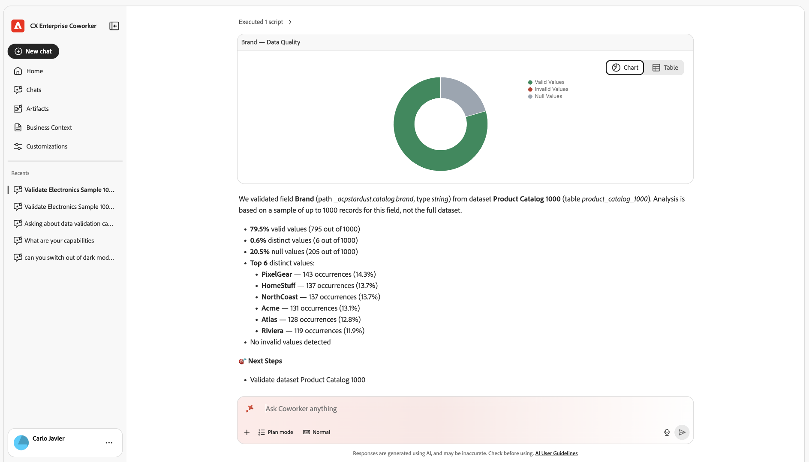

# Validieren Ihrer Experience Platform-Daten mit einem Kollegen

Ein Mitarbeiter verfügt über die Fähigkeit zur Datenvalidierung, die die Datenqualität Ihrer Experience Platform-Datensätze überprüft. Verwenden Sie es, um statistische und semantische Validierungen für Datensätze durchzuführen, Datensatzfelder zu analysieren und Datenqualitätsprobleme zu identifizieren, und zwar alles über eine einzige Konversation im Coworker Chat.

Dateningenieure, Datenadministratoren und Implementierungstechniker verwenden es für schnelle Qualitätsprüfungen, ohne SQL-Abfragen oder komplexe Schemahierarchien.

Diese Kenntnisse verwenden, um:

* Validieren von wichtigen Identitäts- und Ereignisfeldern nach einer neuen Implementierung oder einer Aktualisierung der Implementierung.
* Untersuchen Sie ein vermutetes Zuordnungsproblem, indem Sie die wichtigsten Werte und ungültigen Werte eines Felds überprüfen.
* Führen Sie fortlaufende Prüfungen der Datenverwaltung für kritische Datensätze durch, um Regressionen frühzeitig zu erkennen.

<!--TODO: skill display name "Data Validation skill" confirmed via the published KT-22622 video page (validate-dataset-quality-for-cja.md, merged 2026-09-16). Still need the technical skill ID from engineering (Petru Adrian Snep) for the use-cases overview table row. That page didn't add one either.-->

>[!NOTE]
>
>Diese Qualifikation ist schreibgeschützt. Ihre Daten, Schemata oder Zuordnungen werden dadurch nicht geändert.

## Voraussetzungen

Zur Validierung Ihrer Daten mit Coworker benötigen Sie Folgendes:

* Der Name oder die ID des Datensatzes, den Sie validieren möchten.
* (Optional) Der Name eines bestimmten zu validierenden Felds, wenn Sie nicht möchten, dass die Kenntnisse die Felder automatisch auswählen.

## Starten einer Validierungssitzung

1. Melden Sie sich bei einem Kollegen an.

1. Wählen Sie [!UICONTROL **Neuer Chat**] aus.

1. Fordern Sie den Agenten im Textfeld auf, ein Feld oder einen Datensatz zu validieren. Beispiel:

   **Eingabeaufforderung**

   > Datensatz „Elektronik-Beispiel 1000“ validieren

   

   >[!TIP]
   >
   >Stellen Sie Ihrem Datensatznamen das Wort „Datensatz“ voran, damit die Person ihn korrekt identifizieren kann. Verwenden Sie beispielsweise „Validieren des Datensatzes „Elektronik-Beispiel 1000“ anstelle von „Elektronik-Beispiel 1000 validieren“.

   Ihre Anfrage wird an die Datenvalidierungs-Qualifikation weitergeleitet, die ein Beispiel Ihres Datensatzes analysiert und Ergebnisse in derselben Konversation zurückgibt.

## Zu validierendes Element auswählen

Sie können ein einzelnes Feld oder einen gesamten Datensatz validieren.

>[!BEGINTABS]

>[!TAB Feldüberprüfung]

Validieren eines bestimmten Felds in einem Datensatz. Diese Option bietet:

* Null-Anzahl und Anzahl unterschiedlicher Werte.
* Die wichtigsten eindeutigen Werte und ihre Häufigkeit.
* KI-unterstützte semantische Validierung, bei der Werte markiert werden, die nicht dem erwarteten Format des Felds entsprechen, basierend auf den Metadaten des Felds und seinen tatsächlichen Werten.

Beispiel-Eingabeaufforderungen:

* Überprüfen Sie das E-Mail-Feld im Datensatz Customers_2024 .
* Überprüfen Sie den Feldstatus für den Datensatz customer_events_2024.
* Überprüfen Sie das Feld person.address.city für den Kundendatensatz.

>[!TAB Datensatzvalidierung]

Bis zu fünf Felder in einem Datensatz gleichzeitig überprüfen. Sie können die Felder selbst angeben oder die Kenntnisse den Datensatz analysieren lassen und automatisch die relevantesten Felder auswählen. Diese Option gibt für jedes zu validierende Feld dieselben Informationen wie die Feldüberprüfung zurück.

Beispiel-Eingabeaufforderungen:

* Validieren des Kundendaten-Datensatzes 2024.
* Validieren Sie die Felder E-Mail, Telefon für Kunden_2024.
* Zusammenfassen von firstName, lastName, BirthDate für Kundendaten.

>[!ENDTABS]

## Überprüfen der Ergebnisse

Für jedes validierte Feld werden die Ergebnisse als Zeile in einer Tabelle mit den folgenden Spalten angezeigt:

| Spalte | Beschreibung |
| --- | --- |
| [!UICONTROL Feldname] | Der Name des Feldes. |
| [!UICONTROL Feldpfad] | Der vollständige Pfad des Felds im Schema. |
| [!UICONTROL Feldtyp] | Der Datentyp des Felds. |
| [!UICONTROL Gültige Werte] | Der Prozentsatz der Stichprobenwerte, die die Validierung bestehen. |
| [!UICONTROL Unterschiedliche Werte] | Der Prozentsatz der Stichprobenwerte, die unterschiedlich sind. |
| [!UICONTROL Null-Werte] | Der Prozentsatz der Stichprobenwerte, die null sind. |
| [!UICONTROL Die fünf wichtigsten eindeutigen Werte] | Die fünf häufigsten Werte und ihre Häufigkeiten. |
| [!UICONTROL Die 5 wichtigsten ungültigen Werte] | Die fünf häufigsten ungültigen Werte mit einer Erklärung für jeden Wert, z. B. „Kein gültiges E-Mail-Format“. |
| [!UICONTROL Zusätzliche insight] | Eine kurze natürliche Sprachnotiz über die Qualität des Feldes. |

Unter den Ergebnissen fügt Coworker eine Liste **Nächste Schritte** mit Vorschlägen für Folgeaufforderungen hinzu, wie z. B. die Validierung eines anderen Felds oder die erneute Ausführung des Datensatzes.

Wenn Sie ein einzelnes Feld validieren, gibt Coworker auch ein Diagramm zurück:

Wählen Sie [!UICONTROL **Diagramm**] oder [!UICONTROL **Tabelle**] aus, um zwischen den Ansichten derselben Ergebnisse zu wechseln.

Beim Überprüfen eines Datensatzes werden die Ergebnisse in einer Tabelle mit einer Zeile pro Feld angezeigt. Die Felder, die Sie sich selbst nennen, werden so angezeigt, wie Sie sie festgelegt haben:

Die von der Qualifikation ausgewählten Felder werden automatisch gleich angezeigt:

Wählen Sie [!UICONTROL **CSV**] aus, um die vollständige Ergebnistabelle herunterzuladen.

## Von der Datenvalidierung durchgeführte Prüfungen

Die Qualifikation führt für jedes Feld und jeden Datensatz die folgenden Arten von Prüfungen durch:

* **Vollständigkeitsprüfungen**: Null und fehlende Zählungen und Prozentsätze.
* **Verteilungsprüfungen**: Die wichtigsten Einzelwerte und ihre Verteilungen sowie Erkennung einer hohen Kardinalität.
* **Semantisch vergleicht das Schema**: Verwendet den XDM-Feldnamen, den Typ und die Beschreibung, um daraus abzuleiten, wie ein gültiger Wert aussieht, und kennzeichnet dann Anomalien.
* **Datentypabhängige Prüfungen**, falls zutreffend:
  * E-Mail: Plausibilität von Format und Domain.
  * Telefon: Formatbereitschaft, z. B. E.164.
  * Daten und Zeitstempel: einfache Formatprüfungen, z. B. ISO-8601.

Diese Prüfungen kombinieren deterministische Statistiken mit LLM-unterstützter semantischer Validierung, um Werte zu erkennen, die falsch aussehen, auch wenn sie technisch mit dem Schema übereinstimmen.

## Einschränkungen

Beachten Sie vor der Validierung Ihrer Daten die folgenden Einschränkungen. Diese Einschränkungen gleichen die Leistung mit der Funktionalität aus und legen Erwartungen für die Analyse und Einblicke fest, die Sie erwarten können.

* **Nur Sampling**: Die Qualifikation validiert eine Stichprobe des Datensatzes (in der Regel die letzten 1.000 Zeilen), nicht den gesamten Datensatz. Vollständige Datensatz-Scans sind nicht verfügbar.
* **Maximale Feldanzahl**: Wenn Sie einen Datensatz validieren, analysiert die Qualifikation bis zu fünf Felder pro Anfrage. Sie können diese Felder angeben oder sie automatisch von der Fachkraft auswählen lassen.
* **probabilistische Semantik**: Die Erkennung ungültiger Werte beruht zum Teil auf LLM-basierter Inferenz, bei der gelegentlich subtile Fehler oder Markierungsgrenzwerte übersehen werden können.
* **Schreibgeschützt**: Die Qualifikation ändert Ihre Daten oder deren Schema nicht. Es werden potenzielle Probleme hervorgehoben, aber es werden keine automatisierten Fehlerbehebungen durchgeführt.

Wenn Ihre Validierungsanforderungen erschöpfender sind oder komplexe Geschäftslogik erfordern, ergänzen Sie diese Ergebnisse durch zusätzliche Tools wie Abfrage-Service oder Datenvorbereitungs-Validierungen.

**Verwandte Informationen**

* [Validieren von Adobe Analytics in Customer Journey Analytics-Daten beim Upgrade](./data-validation-aa-cja.md)
* [Validieren von Customer Journey Analytics-Daten mit der Datenvalidierungs-Fähigkeit in Coworker](./validate-dataset-quality-for-cja.md)
* [Validieren Ihrer Daten (KI-Assistent)](/help/agents/data-validation.md)
* [Trust Your Customer Journey Analytics Reporting: Data Validation Skill in Adobe CX Coworker](https://www.youtube.com/watch?v=gCSm_QYSYhk) (Video)
